# Create Architecture Diagram

## Overview

Create or update Mermaid diagrams embedded in ARCHITECTURE.md to visualize complex system architecture, data flow, component relationships, and processes. Mermaid diagrams render directly in GitHub and most Markdown viewers, providing accessible visual documentation.

## Prerequisites

- Basic understanding of Mermaid diagram syntax
- Familiarity with the system component being diagrammed
- Access to `../../context/ARCHITECTURE.md`

## When to Use This Skill

- User says: "Create a diagram for [component/flow]"
- User says: "Visualize the [pipeline/data flow/architecture]"
- After adding new major components
- After refactoring architecture
- When documentation text is complex and visual would help
- When onboarding needs visual overview
- After user requests better visualization

## Mermaid Diagram Types

### 1. Flowchart - Pipeline Flow

**Purpose**: Show sequential processes and decision points

**Use for**:
- Pipeline stages (redistricting → analysis → visualization)
- Script execution flow
- Decision trees
- Algorithm steps

**Example**:
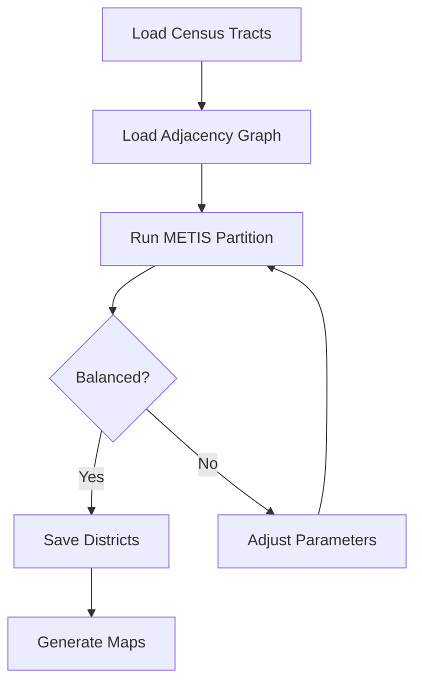

**Syntax basics**:
- `A[Text]` - Rectangle node
- `B{Text}` - Diamond (decision)
- `C([Text])` - Rounded rectangle
- `A --> B` - Arrow from A to B
- `A -->|label| B` - Labeled arrow
- `TD` - Top to down (also: `LR` left-to-right, `BT` bottom-to-top)

### 2. Sequence Diagram - Process Flow

**Purpose**: Show interactions between components over time

**Use for**:
- Script invocations and returns
- API calls
- Message passing
- Multi-stage processes

**Example**:
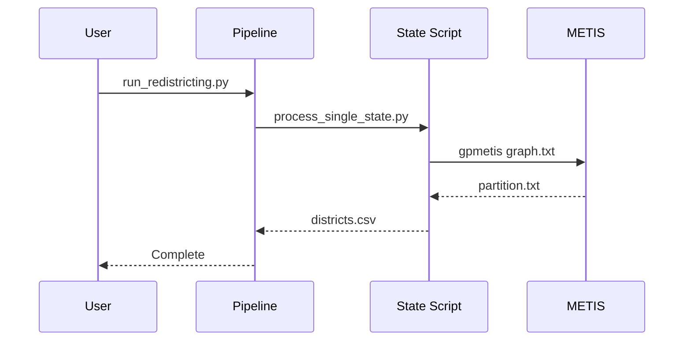

**Syntax basics**:
- `participant Name` - Define actor
- `A->>B: Message` - Solid arrow (call)
- `A-->>B: Response` - Dashed arrow (return)
- `A-xB: Message` - Crossed arrow (async)
- `Note right of A: Text` - Add note

### 3. Class Diagram - Component Structure

**Purpose**: Show component relationships and hierarchies

**Use for**:
- Python package structure
- Class hierarchies
- Module dependencies
- File organization

**Example**:
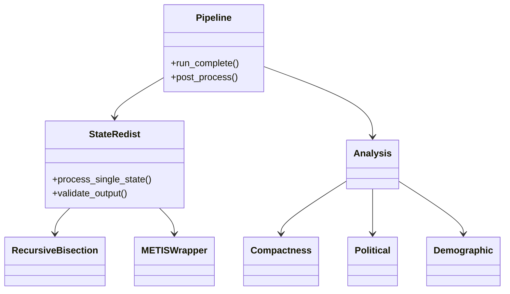

**Syntax basics**:
- `Class --> Other` - Association
- `Class --|> Other` - Inheritance
- `Class --* Other` - Composition
- `Class --o Other` - Aggregation
- `+method()` - Public method
- `-method()` - Private method

### 4. State Diagram - State Transitions

**Purpose**: Show state changes and transitions

**Use for**:
- Pipeline stages
- Data processing states
- Enhancement workflow states
- Task status transitions

**Example**:
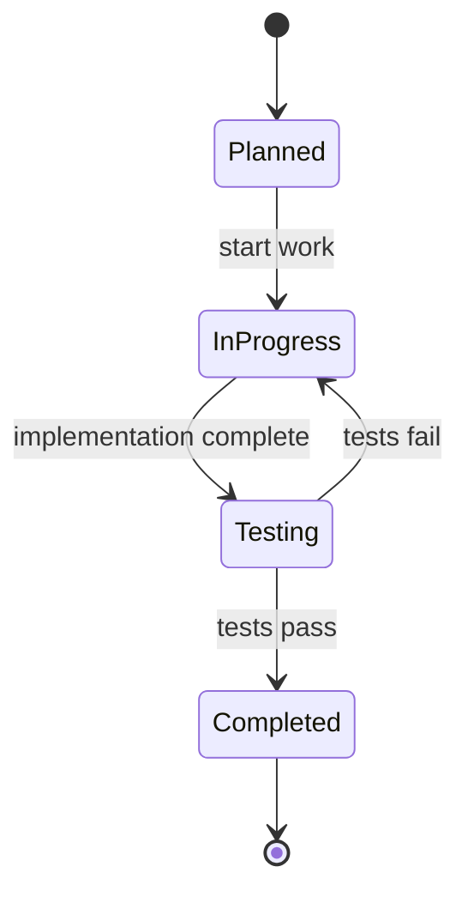

**Syntax basics**:
- `[*]` - Start/end state
- `State1 --> State2: transition` - Transition with label
- `state "Long Name" as S1` - Alias for readability

### 5. ER Diagram - Data Relationships

**Purpose**: Show data entities and relationships

**Use for**:
- CSV file relationships
- Database schema (if added)
- Data flow between files
- Data dependencies

**Example**:
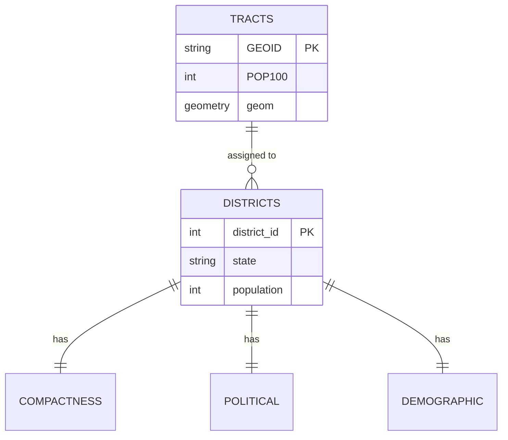

**Syntax basics**:
- `Entity1 ||--|| Entity2` - One-to-one
- `Entity1 ||--o{ Entity2` - One-to-many
- `Entity1 }o--o{ Entity2` - Many-to-many
- `PK` - Primary key
- `FK` - Foreign key

### 6. Gantt Chart - Timeline

**Purpose**: Show project timeline and dependencies

**Use for**:
- Enhancement timelines
- Pipeline stage durations
- Development roadmap
- Dependency visualization

**Example**:
```mermaid
gantt
    title Redistricting Pipeline Timeline
    dateFormat  HH:mm
    axisFormat %H:%M

    section Redistricting
    State 1-10    :a1, 00:00, 20m
    State 11-25   :a2, after a1, 20m
    State 26-51   :a3, after a2, 30m

    section Analysis
    Compactness   :b1, after a3, 30m
    Political     :b2, after a3, 30m
    Demographic   :b3, after a3, 30m

    section Post-Processing
    National Maps :c1, after b1, 15m
    Dashboard     :c2, after c1, 5m
```

## Workflow

### Step 1: Identify What to Diagram

Determine what needs visualization:

**System overview**:
- Full pipeline flow
- Directory structure
- Component hierarchy
- Data flow

**Specific component**:
- New feature integration
- Refactored module
- Complex algorithm
- Multi-step process

**Process flow**:
- User workflow
- Script execution
- Data transformation
- Error handling

### Step 2: Choose Diagram Type

Match diagram type to purpose:

| Need to show... | Use diagram type |
|-----------------|------------------|
| Sequential process | Flowchart |
| Component interaction | Sequence diagram |
| Code structure | Class diagram |
| State changes | State diagram |
| Data relationships | ER diagram |
| Timeline/schedule | Gantt chart |

### Step 3: Draft Diagram Structure

Sketch out:
- **Nodes**: What components/stages/entities?
- **Connections**: How do they relate?
- **Flow direction**: Top-down, left-right?
- **Grouping**: Any logical sections?
- **Labels**: What text describes each element?

### Step 4: Write Mermaid Code

Create the diagram using Mermaid syntax:

**Start simple**:


**Add detail incrementally**:
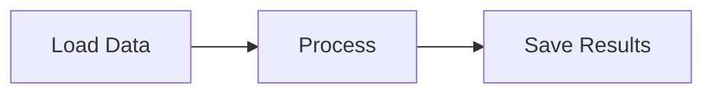

**Add styling**:
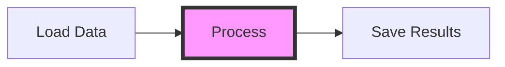

### Step 5: Embed in ARCHITECTURE.md

Insert diagram in appropriate section:

```markdown
## Pipeline Architecture

The redistricting pipeline consists of three main stages:

\`\`\`mermaid
flowchart TD
    subgraph "Stage 1: Redistricting"
        A[Load Tracts] --> B[Load Graph]
        B --> C[METIS Partition]
        C --> D[Save Districts]
    end

    subgraph "Stage 2: Analysis"
        D --> E[Compactness]
        D --> F[Political]
        D --> G[Demographic]
    end

    subgraph "Stage 3: Visualization"
        E --> H[Generate Maps]
        F --> H
        G --> H
        H --> I[Dashboard]
    end
\`\`\`

The pipeline processes 50 states in parallel during stages 1 and 2,
then aggregates results for national visualization in stage 3.
```

### Step 6: Validate Rendering

**Test rendering**:
- GitHub: View ARCHITECTURE.md on GitHub
- VS Code: Install Mermaid preview extension
- Online: Paste into https://mermaid.live/
- Local tools: Use mermaid-cli if available

**Check for**:
- Syntax errors (diagram fails to render)
- Alignment issues (nodes overlapping)
- Missing labels (unlabeled arrows)
- Readability (too complex, unclear flow)

### Step 7: Add Context

Surround diagram with explanatory text:

**Before diagram**:
- What the diagram shows
- Why it's important
- What to focus on

**After diagram**:
- Key insights from diagram
- Important details
- Links to related sections

**Example**:
```markdown
### Data Flow Architecture

The following diagram illustrates how data flows through the pipeline,
from raw census tracts to final dashboard:

\`\`\`mermaid
[... diagram ...]
\`\`\`

Key points:
- Census data enters at top left
- METIS partitioning is the core algorithm (center)
- Three analysis types run in parallel
- All results converge in dashboard generator
```

## Common Diagram Patterns

### Pipeline Flow Pattern

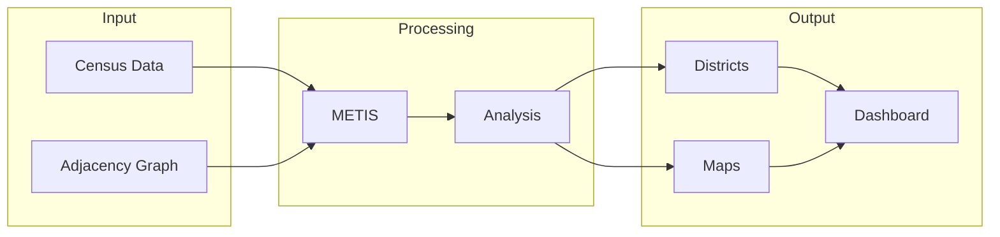

### Script Invocation Pattern

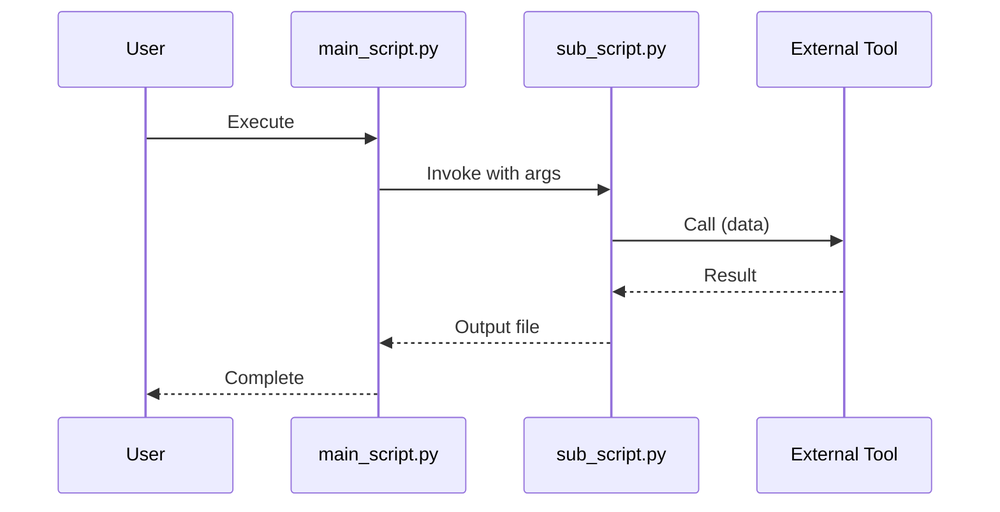

### Directory Structure Pattern

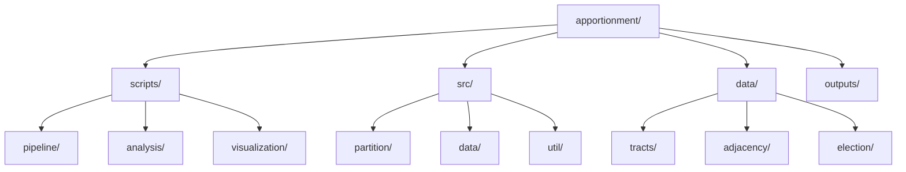

### State Machine Pattern

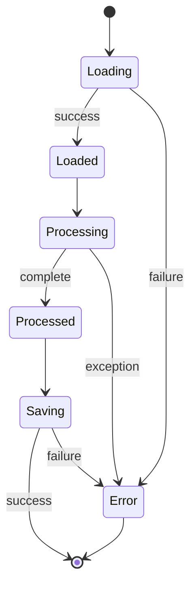

## Styling and Customization

### Node Styling


### Subgraphs

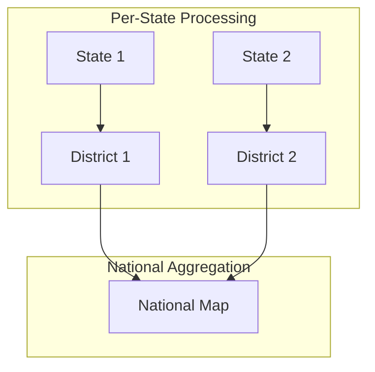

### Comments

```mermaid
flowchart LR
    %% This is a comment, won't be rendered
    A[Step 1] --> B[Step 2]  %% Inline comment
```

## Best Practices

### Simplicity

**DO**:
- Focus on key components
- Limit to 7-10 nodes per diagram
- Break complex systems into multiple diagrams
- Use subgraphs for grouping

**DON'T**:
- Cram everything into one diagram
- Include every detail
- Make diagrams so complex they're hard to read
- Forget labels on arrows

### Clarity

**DO**:
- Use clear, concise node labels
- Label all important arrows
- Choose appropriate arrow types (solid vs dashed)
- Add explanatory text around diagram

**DON'T**:
- Use vague labels like "Process" or "Do stuff"
- Leave arrows unlabeled when meaning unclear
- Mix diagram types inappropriately
- Assume reader understands without context

### Maintainability

**DO**:
- Keep diagram code readable (indentation, spacing)
- Add comments explaining complex parts
- Version control diagrams with docs
- Update diagrams when system changes

**DON'T**:
- Make diagrams so complex they're hard to edit
- Forget to update diagrams during refactoring
- Hard-code specifics that change frequently
- Duplicate information better shown in code

### Consistency

**DO**:
- Use same diagram types for similar concepts
- Follow naming conventions from code
- Use consistent colors/styles within document
- Align diagram style with project documentation

**DON'T**:
- Switch styles arbitrarily
- Use different naming than codebase
- Make each diagram look completely different
- Ignore existing diagram patterns

## Troubleshooting

**Diagram doesn't render**:
```
Issue: Syntax error in Mermaid code
Solution: Check syntax at https://mermaid.live/
          Validate brackets, quotes, keywords
          Check for typos in diagram type
```

**Nodes overlap**:
```
Issue: Layout engine can't separate nodes
Solution: Change flow direction (TD to LR)
          Break into multiple smaller diagrams
          Use subgraphs to organize
```

**Arrows unclear**:
```
Issue: Can't tell what arrows mean
Solution: Add labels to arrows
          Use different arrow styles (solid/dashed)
          Add legend explaining conventions
```

**Too complex**:
```
Issue: Diagram has 30+ nodes, unreadable
Solution: Create hierarchy of diagrams
          High-level overview + detailed sub-diagrams
          Focus each diagram on one aspect
```

**Wrong diagram type**:
```
Issue: Using flowchart for data relationships
Solution: Use ER diagram for data relationships
          Flowchart for process flow
          Sequence for interactions
```

## Integration with Enhancement Workflow

### When to Update Diagrams

**Phase 2: Implementation**:
- Create diagram for new component
- Update diagram if architecture changes

**Phase 5: Documentation**:
- Verify diagrams still accurate
- Add diagrams for new features
- Update ARCHITECTURE.md with changes

### Where Diagrams Go

**ARCHITECTURE.md**:
- System overview diagrams
- Component relationship diagrams
- Data flow diagrams
- Pipeline architecture diagrams

**Enhancement docs**:
- Enhancement-specific diagrams
- Before/after architecture comparisons
- Implementation approach diagrams

**README.md**:
- High-level overview diagram
- Quick start flow diagram
- User workflow diagram

## Examples from Project

### Existing Diagrams

Check ARCHITECTURE.md for existing diagram examples:
```bash
# See current diagrams
grep -A 20 "```mermaid" ../../context/ARCHITECTURE.md
```

**Current diagrams** (as of Enhancement 6):
- Pipeline Architecture (flowchart)
- Data Flow (flowchart)
- Script Hierarchy (class diagram)
- Analysis Integration (sequence diagram)

### Adding New Diagram

Example of adding diagram for new feature:

**Enhancement**: Metro Area Maps

**Diagram to add**: Metro area processing flow

```markdown
### Metro Area Processing

The metro area map generation uses CBSA boundaries to create focused
visualizations of urban districts:

\`\`\`mermaid
flowchart TD
    A[Load CBSA Boundaries] --> B{Area in State?}
    B -->|Yes| C[Load State Districts]
    B -->|No| D[Skip]

    C --> E[Clip to Metro Area]
    E --> F[Generate Focused Map]
    F --> G[Save to metro/{area}/]

    G --> H{More Areas?}
    H -->|Yes| A
    H -->|No| I[Complete]
\`\`\`

This process runs in post-processing stage after all state redistricting
is complete.
```

## Related Skills

- `/update-docs` - Update ARCHITECTURE.md after creating diagram
- `/enhancement-document` - Include diagram in enhancement documentation
- `/create-session-archive` - Document diagram design decisions

## Tools and Resources

### Online Editors

- **Mermaid Live Editor**: https://mermaid.live/
  - Real-time preview
  - Export to SVG/PNG
  - Share diagrams via URL

### Documentation

- **Mermaid Docs**: https://mermaid.js.org/
  - Full syntax reference
  - Examples for each diagram type
  - Advanced features

### VS Code Extensions

- **Mermaid Preview**: Real-time preview in VS Code
- **Markdown Preview Enhanced**: Supports Mermaid rendering
- **Draw.io Integration**: Alternative diagramming tool

## What You'll Get

After creating architecture diagram:
- **Visual documentation** improving understanding
- **Clear communication** of complex systems
- **Embedded diagrams** in Markdown (no external files)
- **Version-controlled** visuals (text-based, git-friendly)
- **Maintainable** diagrams (easy to edit)
- **Accessible** visualization (renders on GitHub, IDE, docs sites)
- **Professional** documentation quality

## Next Steps

- Add diagram to appropriate documentation file
- Add explanatory text around diagram
- Update related documentation sections
- Validate diagram renders correctly
- Link to diagram from other relevant docs
- Consider additional diagrams if needed
