# Create Architecture Diagram

Create or update Mermaid diagrams in ARCHITECTURE.md to visualize complex system architecture, data flow, component relationships, processes. Mermaid renders directly in GitHub/Markdown viewers for accessible visual documentation.

## Prerequisites
Basic understanding of Mermaid syntax, familiarity with component being diagrammed, access to `../../context/ARCHITECTURE.md`

## When to Use
User says "Create diagram for [component/flow]/Visualize [pipeline/data flow/architecture]", after adding new major components, after refactoring architecture, when documentation text complex and visual would help, for onboarding overview, after user requests better visualization

## Mermaid Diagram Types

### 1. Flowchart - Pipeline Flow
**Purpose**: Show sequential processes and decision points
**Use for**: Pipeline stages (redistricting → analysis → viz), script execution flow, decision trees, algorithm steps

**Example**:
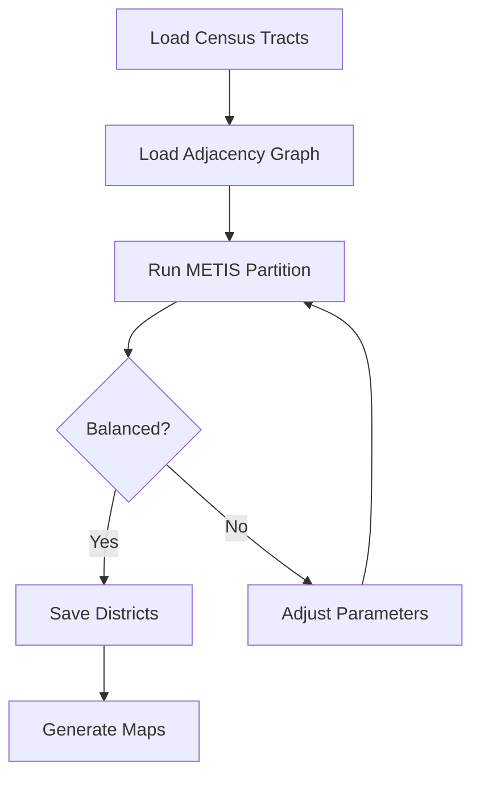

**Syntax**: `A[Text]` (rectangle), `B{Text}` (diamond/decision), `C([Text])` (rounded), `A --> B` (arrow), `A -->|label| B` (labeled arrow), `TD` (top-down) or `LR` (left-right)

### 2. Sequence Diagram - Process Flow
**Purpose**: Show interactions between components over time
**Use for**: Script invocations/returns, API calls, message passing, multi-stage processes

**Example**:
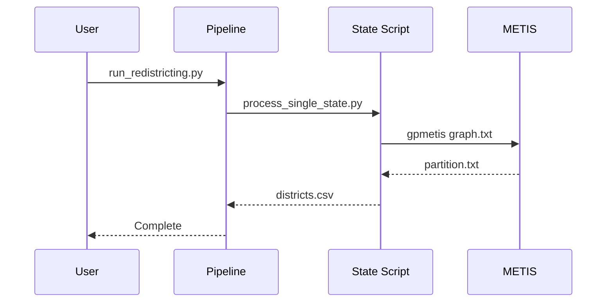

**Syntax**: `participant Name` (define actor), `A->>B: Message` (solid arrow/call), `A-->>B: Response` (dashed arrow/return), `Note right of A: Text` (add note)

### 3. Class Diagram - Component Structure
**Purpose**: Show component relationships and hierarchies
**Use for**: Python package structure, class hierarchies, module dependencies, file organization

**Example**:
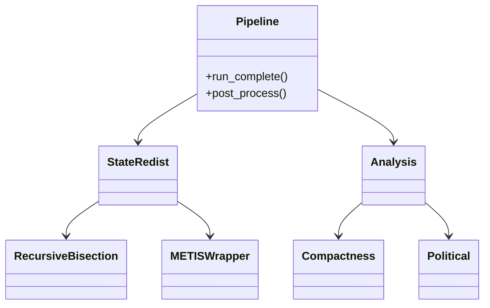

**Syntax**: `Class --> Other` (association), `Class --|> Other` (inheritance), `Class --* Other` (composition), `+method()` (public), `-method()` (private)

### 4. State Diagram - State Transitions
**Purpose**: Show state changes and transitions
**Use for**: Pipeline stages, data processing states, enhancement workflow states, task status transitions

**Example**:
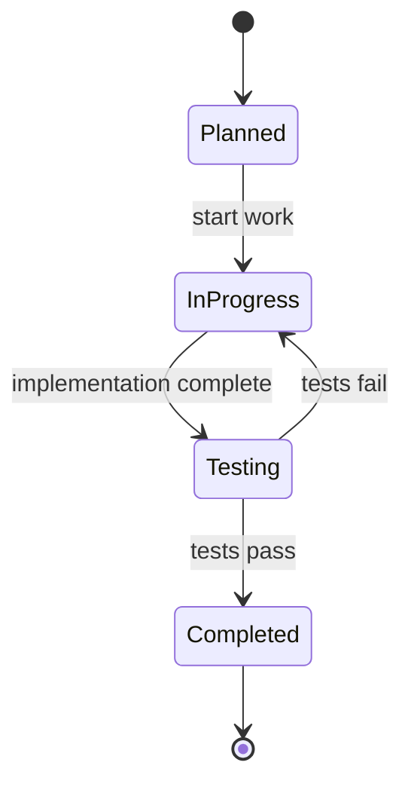

**Syntax**: `[*]` (start/end state), `State1 --> State2: transition` (transition with label)

### 5. ER Diagram - Data Relationships
**Purpose**: Show data entities and relationships
**Use for**: CSV file relationships, database schema, data flow between files, data dependencies

**Example**:
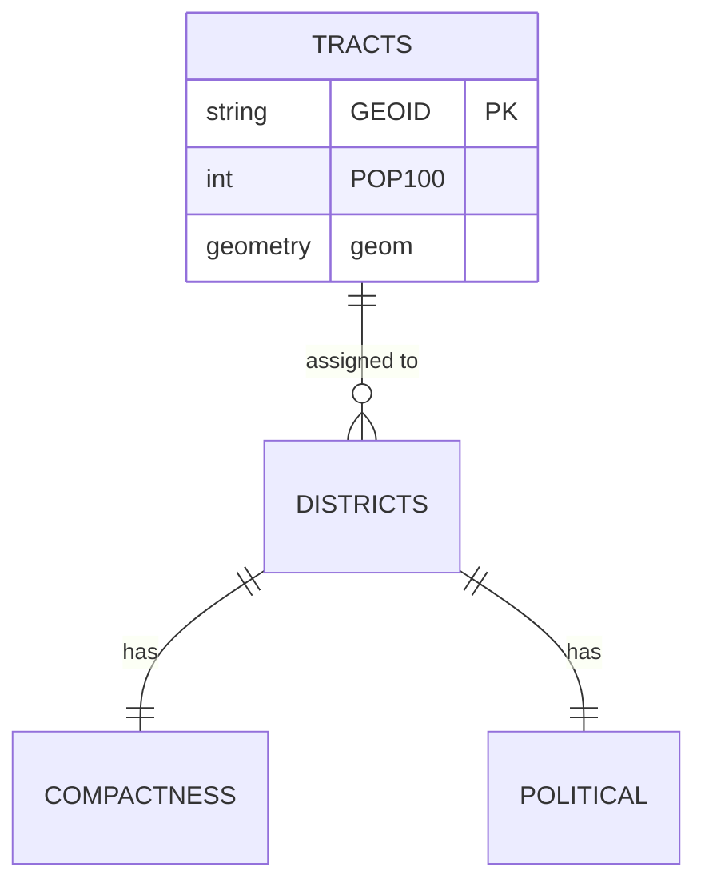

**Syntax**: `Entity1 ||--|| Entity2` (one-to-one), `Entity1 ||--o{ Entity2` (one-to-many), `Entity1 }o--o{ Entity2` (many-to-many), `PK` (primary key), `FK` (foreign key)

### 6. Gantt Chart - Timeline
**Purpose**: Show project timeline and dependencies
**Use for**: Enhancement timelines, pipeline stage durations, development roadmap, dependency visualization

**Example**:
```mermaid
gantt
    title Redistricting Pipeline Timeline
    dateFormat  HH:mm
    axisFormat %H:%M

    section Redistricting
    State 1-10    :a1, 00:00, 20m
    State 11-25   :a2, after a1, 20m

    section Analysis
    Compactness   :b1, after a2, 30m
    Political     :b2, after a2, 30m
```

## Workflow

### Step 1: Identify What to Diagram
**System overview**: Full pipeline flow, directory structure, component hierarchy, data flow
**Specific component**: New feature integration, refactored module, complex algorithm, multi-step process
**Process flow**: User workflow, script execution, data transformation, error handling

### Step 2: Choose Diagram Type
| Need to show... | Use diagram type |
|-----------------|------------------|
| Sequential process | Flowchart |
| Component interaction | Sequence diagram |
| Code structure | Class diagram |
| State changes | State diagram |
| Data relationships | ER diagram |
| Timeline/schedule | Gantt chart |

### Step 3: Draft Diagram Structure
Sketch out: **Nodes** (what components/stages/entities?), **Connections** (how do they relate?), **Flow direction** (top-down, left-right?), **Grouping** (any logical sections?), **Labels** (what text describes each element?)

### Step 4: Write Mermaid Code
**Start simple**:


**Add detail incrementally**:
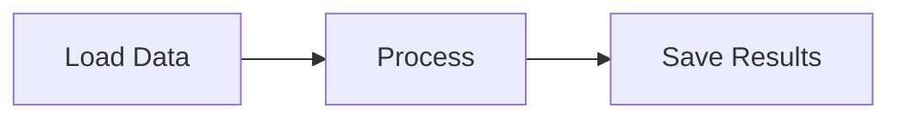

**Add styling**:
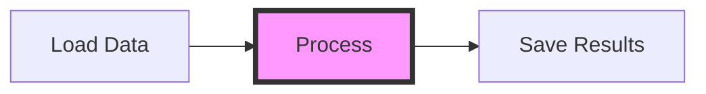

### Step 5: Embed in ARCHITECTURE.md
Insert diagram in appropriate section:
```markdown
## Pipeline Architecture

The redistricting pipeline consists of three main stages:

\`\`\`mermaid
flowchart TD
    subgraph "Stage 1: Redistricting"
        A[Load Tracts] --> B[Load Graph]
        B --> C[METIS Partition]
        C --> D[Save Districts]
    end

    subgraph "Stage 2: Analysis"
        D --> E[Compactness]
        D --> F[Political]
        D --> G[Demographic]
    end
\`\`\`

The pipeline processes 50 states in parallel during stages 1 and 2.
```

### Step 6: Validate Rendering
**Test rendering**: GitHub (view ARCHITECTURE.md), VS Code (Mermaid preview extension), Online (https://mermaid.live/), Local tools (mermaid-cli)
**Check for**: Syntax errors (diagram fails to render), alignment issues (nodes overlapping), missing labels (unlabeled arrows), readability (too complex, unclear flow)

### Step 7: Add Context
**Before diagram**: What the diagram shows, why it's important, what to focus on
**After diagram**: Key insights from diagram, important details, links to related sections

**Example**:
```markdown
### Data Flow Architecture

The following diagram illustrates how data flows through the pipeline:

\`\`\`mermaid
[... diagram ...]
\`\`\`

Key points:
- Census data enters at top left
- METIS partitioning is the core algorithm (center)
- Three analysis types run in parallel
```

## Common Diagram Patterns

### Pipeline Flow Pattern
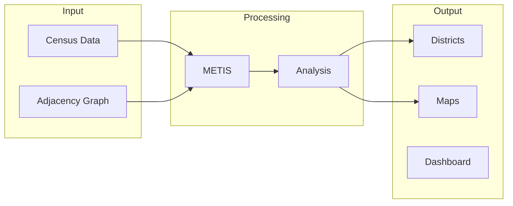

### Script Invocation Pattern
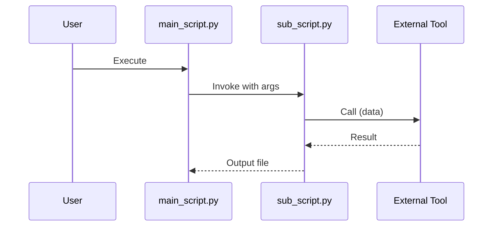

### State Machine Pattern
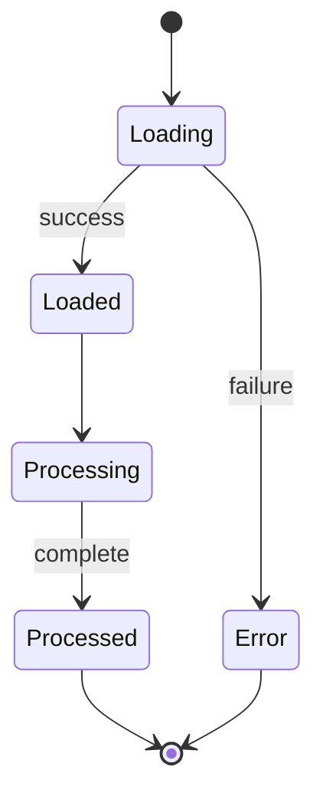

## Styling and Customization

**Node styling**:


**Subgraphs**:
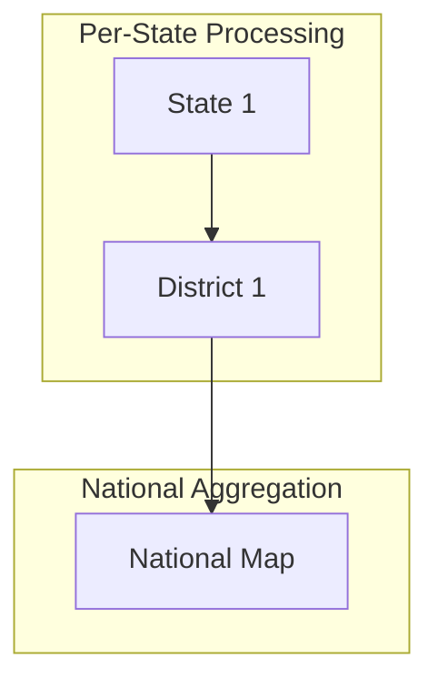

**Comments**:
```mermaid
flowchart LR
    %% This is a comment, won't be rendered
    A[Step 1] --> B[Step 2]  %% Inline comment
```

## Best Practices

**Simplicity**: Focus on key components, limit to 7-10 nodes per diagram, break complex systems into multiple diagrams, use subgraphs for grouping | Don't cram everything, include every detail, make diagrams hard to read, forget labels on arrows

**Clarity**: Use clear concise node labels, label all important arrows, choose appropriate arrow types (solid vs dashed), add explanatory text around diagram | Don't use vague labels ("Process", "Do stuff"), leave arrows unlabeled when unclear, mix diagram types inappropriately, assume reader understands without context

**Maintainability**: Keep diagram code readable (indentation, spacing), add comments explaining complex parts, version control diagrams with docs, update diagrams when system changes | Don't make diagrams so complex they're hard to edit, forget to update during refactoring, hard-code specifics that change frequently, duplicate information better shown in code

**Consistency**: Use same diagram types for similar concepts, follow naming conventions from code, use consistent colors/styles within document, align diagram style with project documentation | Don't switch styles arbitrarily, use different naming than codebase, make each diagram look completely different, ignore existing diagram patterns

## Troubleshooting

**Diagram doesn't render**: Syntax error in Mermaid code → Check syntax at https://mermaid.live/, validate brackets/quotes/keywords, check for typos in diagram type
**Nodes overlap**: Layout engine can't separate nodes → Change flow direction (TD to LR), break into multiple smaller diagrams, use subgraphs to organize
**Arrows unclear**: Can't tell what arrows mean → Add labels to arrows, use different arrow styles (solid/dashed), add legend explaining conventions
**Too complex**: Diagram has 30+ nodes, unreadable → Create hierarchy of diagrams (high-level overview + detailed sub-diagrams), focus each diagram on one aspect
**Wrong diagram type**: Using flowchart for data relationships → Use ER diagram for data relationships, flowchart for process flow, sequence for interactions

## Integration with Enhancement Workflow

**When to update diagrams**:
- **Phase 2: Implementation**: Create diagram for new component, update diagram if architecture changes
- **Phase 5: Documentation**: Verify diagrams still accurate, add diagrams for new features, update ARCHITECTURE.md

**Where diagrams go**:
- **ARCHITECTURE.md**: System overview, component relationships, data flow, pipeline architecture
- **Enhancement docs**: Enhancement-specific diagrams, before/after architecture comparisons, implementation approach
- **README.md**: High-level overview, quick start flow, user workflow

## Examples from Project

**Existing diagrams**: Check ARCHITECTURE.md → `grep -A 20 "\`\`\`mermaid" ../../context/ARCHITECTURE.md`
**Current diagrams** (as of Enhancement 6): Pipeline Architecture (flowchart), Data Flow (flowchart), Script Hierarchy (class diagram), Analysis Integration (sequence diagram)

## Tools and Resources

**Online Editors**: Mermaid Live Editor (https://mermaid.live/) - real-time preview, export to SVG/PNG, share via URL
**Documentation**: Mermaid Docs (https://mermaid.js.org/) - full syntax reference, examples for each diagram type, advanced features
**VS Code Extensions**: Mermaid Preview (real-time preview), Markdown Preview Enhanced (supports Mermaid rendering), Draw.io Integration (alternative diagramming tool)

## What You'll Get
Visual documentation improving understanding, clear communication of complex systems, embedded diagrams in Markdown (no external files), version-controlled visuals (text-based, git-friendly), maintainable diagrams (easy to edit), accessible visualization (renders on GitHub/IDE/docs sites), professional documentation quality

## Next Steps
Add diagram to appropriate documentation file, add explanatory text around diagram, update related documentation sections, validate diagram renders correctly, link to diagram from other relevant docs, consider additional diagrams if needed

## Related Skills
`/update-docs` (update ARCHITECTURE.md after creating diagram), `/enhancement-document` (include diagram in enhancement documentation), `/create-session-archive` (document diagram design decisions)
