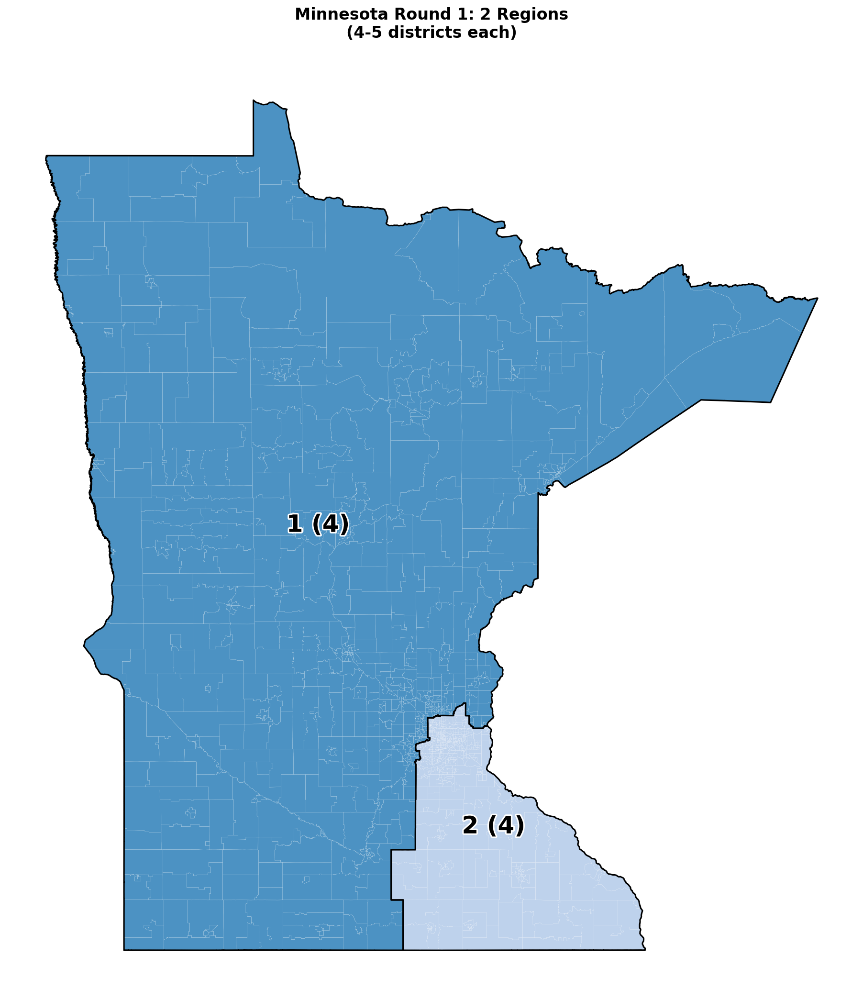
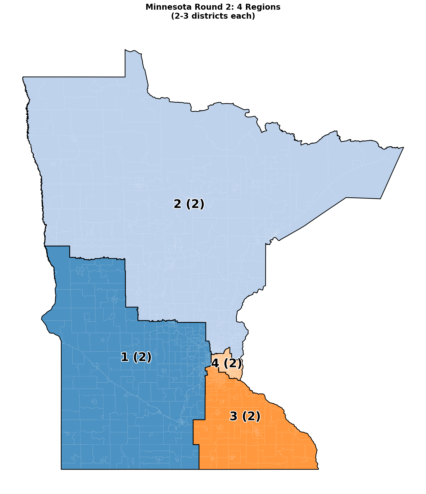
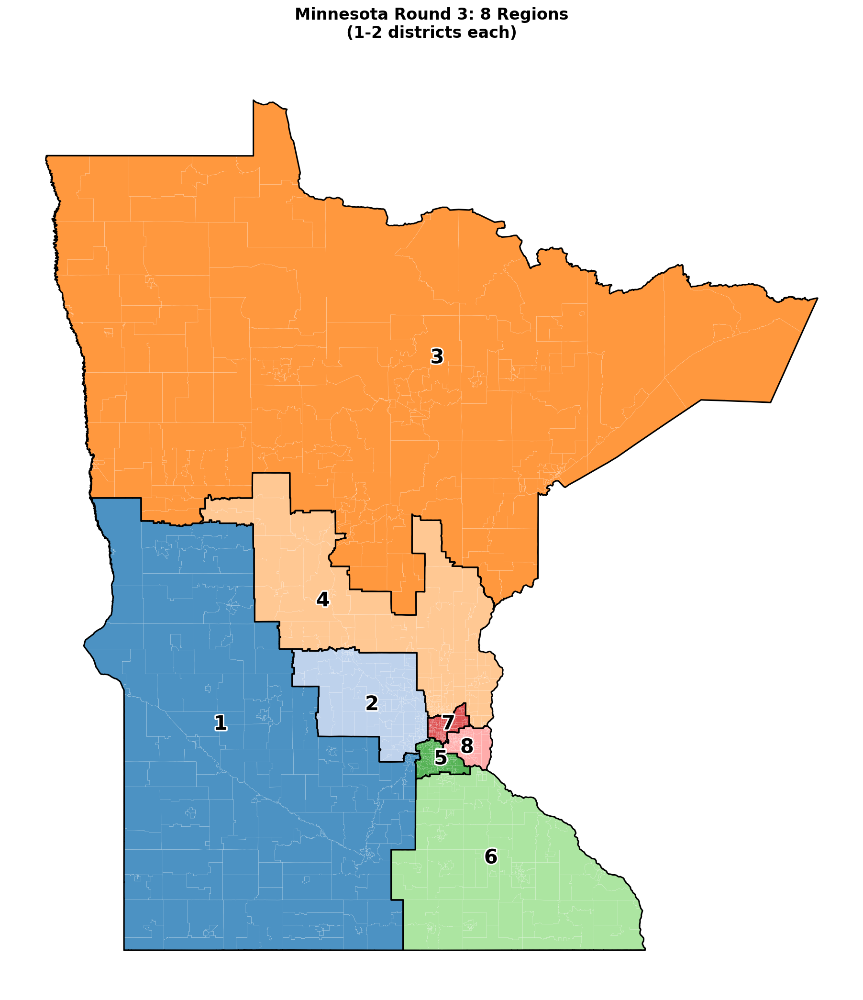
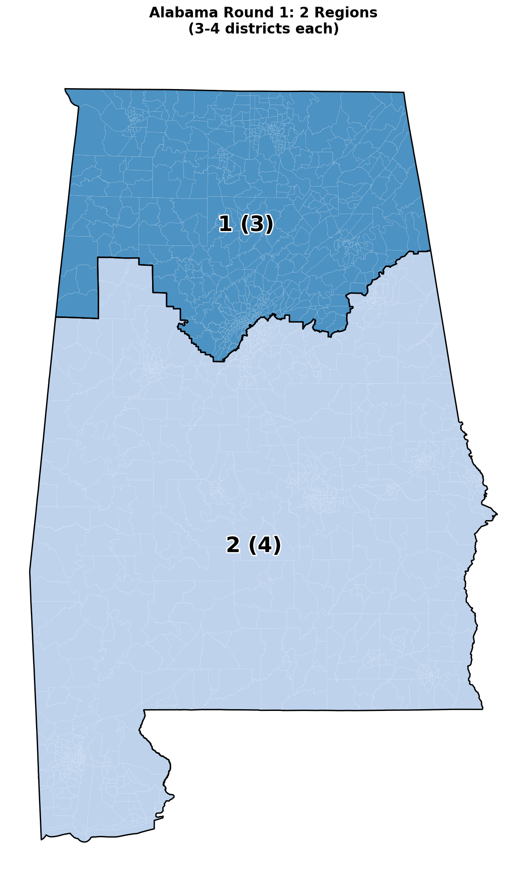
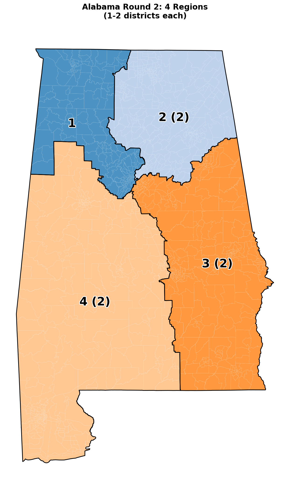
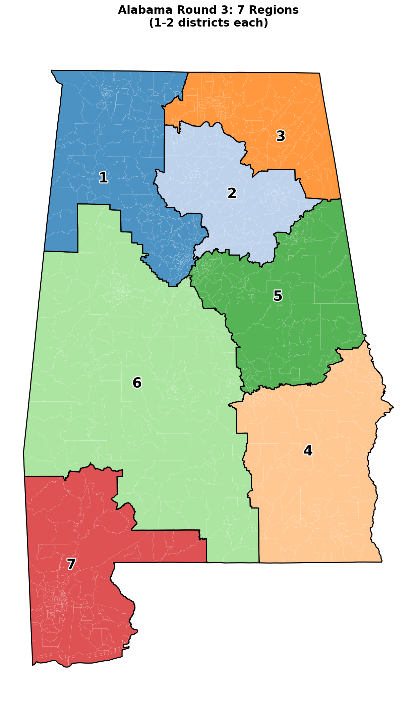

# Apportionment

Algorithmic congressional redistricting for all 50 U.S. states using recursive graph bisection and the METIS partitioner. Given only census-tract geometry and population, the pipeline produces 435 compact, population-balanced, contiguous districts — with no political or racial data as input.

**Headline result (2020 Census, edge-weighted mode):** mean Polsby–Popper compactness **0.367**, a **+56% improvement** over the unweighted baseline and **+20% over enacted 2020 congressional districts**. 37 of 50 states exceed enacted compactness; Illinois improves +174%, Louisiana +104%, New Hampshire +102%.

## Research

Three papers document the method and results. Sources live under [`artifacts/papers/`](artifacts/papers/) and compile to PDF via each paper's `compile.bat` / `compile.sh`.

### Paper 1 — Introducing Recursive Bisection to Redistricting
[`artifacts/papers/01_recursive_bisection/`](artifacts/papers/01_recursive_bisection/)

Baseline method. Represents a state's census tracts as a graph, then applies METIS recursive bisection under a population-balance constraint to produce districts from only population and adjacency. Evaluated on all 50 states (2020 Census) with a mean population deviation of 2.79%.

### Paper 2 — Edge-Weighted Recursive Bisection for Compact Congressional Redistricting
[`artifacts/papers/02_edge_weighted_bisection/`](artifacts/papers/02_edge_weighted_bisection/)

Core contribution. Weights graph edges by actual shared boundary length, so minimizing the weighted cut directly minimizes district perimeter — the denominator of Polsby–Popper. Achieves mean Polsby–Popper **0.367** nationally (+56% vs. unweighted, +20% vs. enacted 2020). Introduces county-based bridge edges for water crossings using state-specific median boundary lengths.

### Paper 3 — Algorithmic Congressional Redistricting via Edge-Weighted Recursive Bisection
[`artifacts/papers/03_combined_recursive_bisection/`](artifacts/papers/03_combined_recursive_bisection/)

Consolidated treatment with cross-census validation. Running the same algorithm on 2010 data yields Polsby–Popper 0.320 (vs. 0.367 for 2020) — only 10.3% variation across vastly different political environments, evidence that geographic structure rather than political opportunity drives performance. The gap between algorithmic and enacted districts shrinks ~50% from 2010 to 2020, quantifying the impact of redistricting reforms.

### Also under `artifacts/`
- **Presentation**: [`presentations/edge_weighted_bisection/`](artifacts/presentations/edge_weighted_bisection/) — conference-style deck
- **Guides**: [`guides/edge_weighted_bisection/`](artifacts/guides/edge_weighted_bisection/) (layman's guide) and [`guides/command_reference/`](artifacts/guides/command_reference/)

## Dashboard

**[View results dashboard →](https://giodl73-repo.github.io/DEXTRO/dashboard.html)** — per-state compactness scores, population balance, and comparison against enacted 2020 congressional districts for all 50 states.

## Figures

### Bisection rounds — Minnesota (8 districts, 3 rounds)
| Round 1 (1 → 2) | Round 2 (2 → 4) | Round 3 (4 → 8) |
| :---: | :---: | :---: |
|  |  |  |

### Bisection rounds — Alabama (7 districts, 3 rounds)
| Round 1 | Round 2 | Round 3 |
| :---: | :---: | :---: |
|  |  |  |

Maps are produced by the pipeline at `outputs/V1/{year}/states/{state}/maps/rounds/round_*.png`.

## Quick Start

```bash
pip install -r requirements.txt
```

On Windows, `pymetis` may need `conda install -c conda-forge metis` first.

### Run the full pipeline

```bash
# All 3 census years in parallel (2-4h)
run -v v1

# Single year
run -y 2020 -v v1

# Specific states
run -y 2020 -v v1 -st MN AL

# Test run (outputs under outputs/dev/)
runtest -y 2020 -v test -st VT
```

`run` and `runtest` are `doskey` aliases for `run_redistricting.bat` and `run_test.bat`. See `run -h` for all flags.

### Run a single state

```bash
python scripts/pipeline/run_state_redistricting.py --state CA --year 2020
```

### Build the dashboard

```bash
python scripts/web/generate_master_dashboard.py
# → outputs/index.html
```

## Algorithm

Recursive bisection produces `N` districts in `⌈log₂ N⌉` rounds. At each step, METIS splits the current region into two subregions under a ±0.5% population-balance constraint with the `-contig` flag enforcing connectedness. Odd counts (e.g. 9 → 4+5) adjust the target partition weights so each child gets its share.

The **edge-weighted** variant weights every graph edge by the shared boundary length between the two adjacent tracts. Minimizing the weighted edge cut then directly minimizes the total perimeter of the resulting districts — which, at fixed area, maximizes Polsby–Popper compactness. Water crossings use county-based bridge edges with state-specific median boundary lengths.

Full details: [`docs/RECURSIVE_BISECTION.md`](docs/RECURSIVE_BISECTION.md).

## Data

Inputs, per census year (2000, 2010, 2020):
- **Geometry**: TIGER/Line tract shapefiles
- **Population**: P.L. 94-171 redistricting files
- **Places**: TIGER/Line places shapefiles (for city labels)

All census-year data lives under `data/{year}/` (gitignored). Download with:

```bash
python scripts/data/download_orchestrator.py --stages redistricting --year 2020
```

## Project Structure

```
apportionment/
├── src/apportionment/       # Library: partition/, data/, visualization/
├── scripts/                 # Executables: pipeline/, data/, political/, demographic/, compactness/, web/
├── artifacts/               # Papers, presentations, guides (LaTeX sources)
├── data/{year}/             # Raw census data (gitignored)
├── outputs/                 # Pipeline outputs (gitignored)
├── web/                     # Dashboard templates
├── docs/                    # Human-facing documentation
├── context/                 # Developer / AI-assistant docs
└── tests/                   # unit/, integration/, e2e/ (215 tests, ~24s)
```

## Testing

```bash
pytest tests/ -v             # All 215 tests (~24s)
pytest tests/unit/ -v        # Unit only (135 tests)
```

See [`tests/README.md`](tests/README.md) for categories and fixtures.

## Documentation

**Start here**
- [`docs/GETTING_STARTED.md`](docs/GETTING_STARTED.md) — install + first run
- [`docs/RECURSIVE_BISECTION.md`](docs/RECURSIVE_BISECTION.md) — algorithm walkthrough
- [`docs/DATA_DICTIONARY.md`](docs/DATA_DICTIONARY.md) — output field reference

**Deeper**
- [`docs/VISUALIZATION_GUIDE.md`](docs/VISUALIZATION_GUIDE.md), [`docs/CENSUS_DATA_PROCESSING.md`](docs/CENSUS_DATA_PROCESSING.md), [`docs/DEPENDENCIES.md`](docs/DEPENDENCIES.md), [`docs/TROUBLESHOOTING.md`](docs/TROUBLESHOOTING.md)

**Contributing**
- [`docs/CONTRIBUTING.md`](docs/CONTRIBUTING.md) — workflow + git practices
- [`docs/CHANGELOG.md`](docs/CHANGELOG.md) — version history
- [`context/ENHANCEMENT_WORKFLOW.md`](context/ENHANCEMENT_WORKFLOW.md) — 6-phase process for new features

**For AI assistants**
- [`CLAUDE.md`](CLAUDE.md), [`context/ARCHITECTURE.md`](context/ARCHITECTURE.md), [`context/CODING_PATTERNS.md`](context/CODING_PATTERNS.md), [`context/SKILLS.md`](context/SKILLS.md)

## Constraints

- Population: within ±0.5% of state target
- Contiguity: all districts connected (enforced by METIS `-contig`)
- Compactness: minimized via METIS edge cut (weighted = perimeter-minimizing)
- **No political or racial data** used as input at any stage
