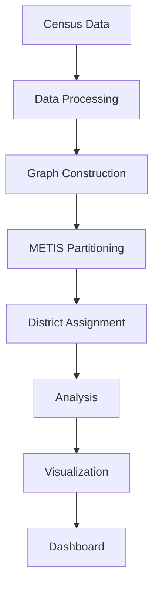

# E6: Create System Architecture Diagrams

**Status**: ✅ COMPLETED
**Priority**: Medium
**Estimated Complexity**: Medium
**Created**: January 2026
**Completed**: January 2026
**Commits**: [062f177](https://github.com/giodl_microsoft/redistricting/commit/062f177489dd4c5718107d09fd9540caf6451071), [4a08bd4](https://github.com/giodl_microsoft/redistricting/commit/4a08bd4e2be0173b8b7bbe61116fab72b828e643)
**Size**: M - 1,331 lines changed (10 files)

**Completion Date:** January 12, 2026
**Implementation:** Created 4 Mermaid diagrams in `docs/diagrams/`, embedded in `ARCHITECTURE.md`.

### Goal
Generate visual architecture diagrams showing system components, data flow, and relationships.

### Description
Create comprehensive diagrams to supplement the written documentation:
- **System Overview**: High-level component diagram (data → processing → visualization)
- **Pipeline Flow**: Step-by-step redistricting pipeline with data transformations
- **Script Hierarchy**: Tree showing script dependencies and execution order
- **Data Flow**: How data moves from Census sources through to final outputs
- **Module Structure**: Library organization (src/apportionment)

### Implementation Plan

#### Tools/Format
- **Mermaid**: Markdown-based diagrams (GitHub-compatible, version-controllable)
- **GraphViz/DOT**: More complex layouts if needed
- **Draw.io**: Editable diagrams with source files (.drawio)

#### Diagrams to Create

**1. System Architecture Overview**


**2. Pipeline Flow Diagram**
- Show complete 50-state pipeline
- Highlight parallel processing
- Indicate skip logic and resumability
- Mark critical vs optional steps

**3. Script Dependency Graph**
- run_complete_redistricting.py at root
- Branch to per-state processing
- Show post-processing aggregation
- Display analysis stages

**4. Data Format Evolution**
- Raw TIGER/Line shapefiles → Parquet tracts
- Election data → Tract-level aggregates
- District assignments → Summary CSVs
- GeoDataFrames → PNG maps

**5. Module Structure**
- src/apportionment/ package layout
- scripts/ directory organization
- Data directory structure

#### Output Locations
- `docs/diagrams/` - Source files (.mmd, .drawio)
- `docs/diagrams/rendered/` - PNG exports
- Embed in `ARCHITECTURE.md` via relative paths

#### Integration
Update `ARCHITECTURE.md` to include diagram embeds:
```markdown
## System Architecture


The redistricting system consists of...
```

### Benefits
- Visual understanding for new developers
- Easier to explain system design
- Quick reference for component relationships
- Documentation in ARCHITECTURE.md more accessible

### Estimated Complexity
**Medium** (2-3 hours)
- Straightforward with Mermaid
- Most information already documented
- Main effort in layout and clarity
