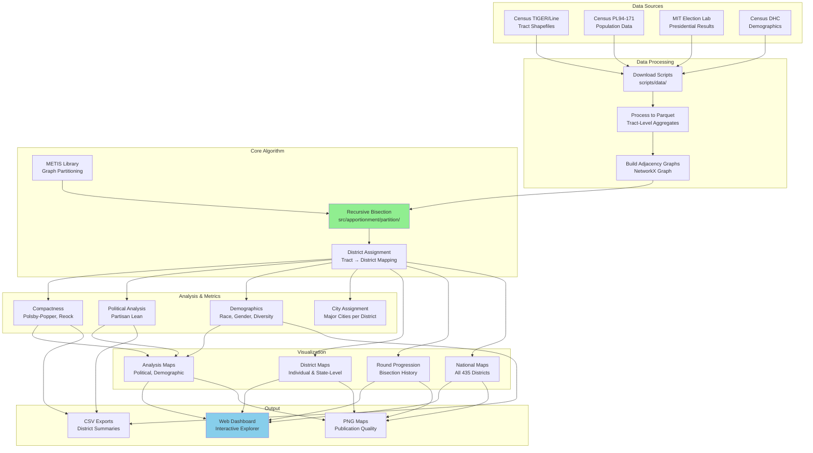

# System Architecture

This document explains the design of the redistricting system, key algorithms, and how components interact.

## Table of Contents
1. [Visual Diagrams](#visual-diagrams)
2. [System Overview](#system-overview)
3. [Data Flow](#data-flow)
4. [Algorithm: Recursive Bisection](#algorithm-recursive-bisection)
5. [Component Architecture](#component-architecture)
6. [Key Design Decisions](#key-design-decisions)
7. [Scalability](#scalability)

---

## Visual Diagrams

The following diagrams provide visual representations of the system architecture, pipeline flow, and data transformations. All diagrams are in Mermaid format and are version-controlled in `docs/diagrams/`.

### System Overview

High-level architecture showing components from data sources to final outputs:



### Pipeline Flow

Complete pipeline execution showing parallel/sequential modes and all phases:

```mermaid
graph TD
    START[run_complete_redistricting.py] --> PARALLEL{Parallel or<br/>Sequential?}

    PARALLEL -->|Parallel| P1[Process 4-8 States<br/>Simultaneously]
    PARALLEL -->|Sequential| S1[Process States<br/>One at a Time]

    P1 --> STATE[Per-State Processing]
    S1 --> STATE

    subgraph "State Processing (run_state_redistricting.py)"
        STATE --> ST1[Load Tract Data<br/>& Adjacency Graph]
        ST1 --> ST2[Recursive Bisection<br/>METIS Partitioning]
        ST2 --> ST3[Create District Summary<br/>Population, Compactness]
        ST3 --> ST4[Assign Cities to Districts]
        ST4 --> ST5[Generate Maps<br/>Districts, Rounds, Individual]
    end

    ST5 --> CHECK{All 50 States<br/>Complete?}
    CHECK -->|No| STATE
    CHECK -->|Yes| AGG[Aggregation Phase]

    subgraph "US Aggregation"
        AGG --> AG1[Create US District Summary<br/>All 435 Districts]
        AG1 --> AG2[Create US Rounds Hierarchy<br/>National Bisection Tree]
        AG2 --> AG3[Create US National Maps<br/>Base, With Cities]
        AG3 --> AG4[Create US Round Progression<br/>Rounds 1-6]
    end

    AG4 --> ANALYSIS[Analysis Phase]

    subgraph "Political Analysis"
        ANALYSIS --> PA1[Analyze Districts<br/>Partisan Lean per State]
        PA1 --> PA2[Visualize Partisan Lean<br/>Maps with D/R Counts]
        PA2 --> PA3[Create National Political Map<br/>All 435 Districts]
    end

    PA3 --> DEMO[Demographic Phase]

    subgraph "Demographic Analysis"
        DEMO --> DM1[Analyze Demographics<br/>Race, Gender per State]
        DM1 --> DM2[Visualize Demographics<br/>Diversity, Majority Maps]
        DM2 --> DM3[Create National Demographic Map<br/>All 435 Districts]
    end

    DM3 --> COMPACT[Compactness Phase]

    subgraph "Compactness Visualization"
        COMPACT --> CP1[Visualize Compactness<br/>Polsby-Popper, Reock Maps]
    end

    CP1 --> FINISH[Pipeline Complete<br/>Generate Dashboard]

    style STATE fill:#FFE4B5
    style AGG fill:#E0BBE4
    style ANALYSIS fill:#B4E7CE
    style DEMO fill:#FFDAB9
    style COMPACT fill:#B0E0E6
    style FINISH fill:#90EE90
```



**For additional diagrams** (Script Dependencies, Data Flow), see [`docs/diagrams/`](diagrams/).

---

## System Overview

### What This System Does

Creates congressional districts for all 50 US states using:
- **Input**: Census tract geometries + population data
- **Algorithm**: Recursive bisection with METIS graph partitioning
- **Output**: District assignments, maps, metrics, analysis

### Why This Approach?

**Alternative**: Manual redistricting by legislatures
- **Problem**: Gerrymandering, bias, lack of transparency
- **Our Solution**: Algorithmic, reproducible, geography-aware

**Alternative**: Other algorithms (simulated annealing, genetic algorithms)
- **Problem**: Slow, complex, unpredictable
- **Our Solution**: Fast, simple, deterministic (given same inputs)

---

## Data Flow

### High-Level Pipeline

```
┌─────────────────────────────────────────────────────────────┐
│ 1. DATA ACQUISITION                                         │
│                                                             │
│  Census TIGER/Line → Download tracts & places (by state)   │
│  Census API       → Download demographics (by state)       │
│  Election Data    → Download election results (by tract)   │
└─────────────────┬───────────────────────────────────────────┘
                  │
                  ▼
┌─────────────────────────────────────────────────────────────┐
│ 2. DATA PROCESSING                                          │
│                                                             │
│  Tracts        → Build adjacency graphs (NetworkX)         │
│  Demographics  → Process to tract-level parquet files      │
│  Elections     → Geocode to tracts, aggregate              │
└─────────────────┬───────────────────────────────────────────┘
                  │
                  ▼
┌─────────────────────────────────────────────────────────────┐
│ 3. REDISTRICTING (Per State)                                │
│                                                             │
│  Input: Tracts + Adjacency Graph + Target # Districts      │
│  Algorithm: Recursive Bisection with METIS                 │
│  Output: tract_idx → district assignments                  │
└─────────────────┬───────────────────────────────────────────┘
                  │
                  ▼
┌─────────────────────────────────────────────────────────────┐
│ 4. ANALYSIS & VISUALIZATION                                 │
│                                                             │
│  Political     → Partisan lean, competitive districts      │
│  Demographic   → Gender, race/ethnicity, diversity         │
│  Compactness   → Polsby-Popper, Reock metrics              │
│  Maps          → District maps, city labels, analysis maps │
└─────────────────────────────────────────────────────────────┘
```

### Detailed Data Flow

```
data/
├── raw/                          # Downloaded from Census
│   ├── {state}_tracts_2020.parquet    (Geometries + population)
│   ├── {state}_places_2020.parquet    (City points)
│   ├── elections/
│   │   └── {state}_precinct_2020.csv  (Precinct-level results)
│   └── demographics/
│       └── {state}_demographics_2020.csv (Tract-level demographics)
│
├── adjacency/                    # Generated from tracts
│   └── {state}_adjacency_2020.pkl     (NetworkX Graph)
│
└── processed/                    # Aggregated/processed
    ├── elections/
    │   └── 2020_president_tract.parquet    (All states, by tract)
    └── demographics/
        └── 2020_demographics_tract.parquet (All states, by tract)

                    ↓ PROCESSING ↓

outputs/us_2020_v1/
├── states/
│   └── california/              # Per-state results
│       ├── final_assignments.pkl         (tract_idx → district)
│       ├── district_summary.csv          (Metrics per district)
│       ├── district_cities.csv           (Major cities)
│       ├── rounds_hierarchy.csv          (Bisection tree)
│       ├── maps/
│       │   ├── california_52_districts.png
│       │   ├── districts/        (Individual district PNGs)
│       │   └── round_*.png       (Bisection visualization)
│       ├── political_analysis/
│       │   ├── district_political_2020.csv
│       │   └── maps/
│       └── demographic_analysis/
│           ├── district_demographics.csv
│           └── maps/
│               ├── gender_balance.png
│               ├── majority_race.png
│               └── diversity_index.png
│
├── us_rounds_hierarchy.csv      # National aggregate
├── us_district_summary.csv
└── us_national_map.png          # All 435 districts
```

---

## Algorithm: Recursive Bisection

The core algorithm uses recursive bisection with METIS graph partitioning to divide census tracts into congressional districts.

**Core Approach**:
- Problem: Partition N tracts into K districts with equal population
- Solution: Repeatedly split regions in half (binary splits) until reaching K districts
- Tool: METIS library for finding optimal graph cuts

**Key Benefits**:
- Fast (log₂K levels of recursion)
- Well-balanced population distribution
- Geographically compact (minimizes edge cuts)
- Hierarchical structure (easy to visualize)

**Example**: California with 52 districts requires ⌈log₂(52)⌉ = 6 rounds of bisection.

For a detailed explanation including visual walkthrough, pseudocode, METIS integration details, and implementation notes, see **[RECURSIVE_BISECTION.md](RECURSIVE_BISECTION.md)**.

---

## Component Architecture

### Directory Structure

```
redistricting/
├── src/apportionment/          # Core library (algorithmic)
│   ├── data/                   # Data loading & validation
│   ├── redistricting/          # METIS wrapper, bisection algorithm
│   ├── compactness/            # Metric calculations
│   └── visualization/          # Map utilities
│
├── scripts/                    # Executable scripts (orchestration)
│   ├── pipeline/               # Main workflow orchestration
│   ├── political/              # Political & demographic analysis
│   ├── data/                   # Data acquisition
│   ├── validation/             # Testing & validation
│   └── debug/                  # Debugging utilities
│
├── data/                       # All data files
│   ├── raw/                    # Downloaded, unmodified
│   ├── processed/              # Cleaned, aggregated
│   └── adjacency/              # Generated graphs
│
└── outputs/                    # Results
    └── us_{year}_{version}/
        ├── states/             # Per-state results
        └── *.csv, *.png        # National aggregates
```

### Separation: Library vs Scripts

**src/apportionment/** (Library)
- Pure functions, no I/O side effects
- Reusable components
- Unit testable
- No progress bars, no print statements

**scripts/** (Executable)
- Orchestration, I/O, progress reporting
- CLI argument parsing
- Calls library functions
- Manages file paths, subprocess communication

### Example: Two-Layer Design

**Library (src/apportionment/redistricting/bisection.py)**:
```python
def redistribute_recursive(graph, populations, num_districts, niter=100):
    """
    Pure algorithm - no file I/O, no progress bars.

    Returns: assignments dictionary
    """
    # ... algorithm ...
    return assignments
```

**Script (scripts/pipeline/run_state_redistricting.py)**:
```python
def main():
    # Parse arguments
    args = parser.parse_args()

    # Load data
    tracts = gpd.read_parquet(f'data/raw/{state}_tracts_2020.parquet')
    graph = load_adjacency_graph(state)

    # Progress reporting
    with tqdm(total=num_districts) as pbar:
        # Call library function
        assignments = redistribute_recursive(
            graph, populations, num_districts
        )
        pbar.update(num_districts)

    # Save results
    save_assignments(assignments, output_dir)
```

---

## Key Design Decisions

### 1. Census Tracts as Base Unit

**Decision**: Use census tracts (not blocks, not precincts)

**Why tracts?**
- ✅ Stable boundaries across decades
- ✅ ~4,000 people each (good granularity)
- ✅ Available nationwide with consistent data
- ✅ TIGER/Line provides geometries + population
- ✅ Smaller than counties, larger than blocks

**Alternatives considered**:
- Census blocks: Too small (~100 people), too many (7M+ nationwide)
- Counties: Too large, inflexible
- Precincts: Vary by state, change frequently, no standard geometries

### 2. METIS for Graph Partitioning

**Decision**: Use METIS gpmetis algorithm

**Why METIS?**
- ✅ Fast: Handles 10,000+ node graphs in seconds
- ✅ Quality: Produces compact, balanced partitions
- ✅ Proven: Industry standard (used in HPC, circuit design)
- ✅ Available: Open source, Python bindings (pymetis)

**Alternatives considered**:
- Simulated annealing: Too slow, unpredictable
- Genetic algorithms: Complex, hard to tune
- Greedy algorithms: Poor quality, local optima

### 3. Recursive Bisection over K-way

**Decision**: Binary splits, recursive

**Why binary?**
- ✅ Fast: log₂K rounds instead of direct K-way
- ✅ Balanced: Easy to enforce population balance
- ✅ Hierarchical: Creates natural district groupings
- ✅ Visualizable: Binary tree structure

**Trade-off**:
- ❌ May create slightly less compact districts than optimal K-way
- ✅ But much faster and more stable

### 4. Parquet over CSV

**Decision**: Use Parquet for tabular data

**Why Parquet?**
- ✅ Fast: Columnar storage, efficient reads
- ✅ Compressed: 5-10x smaller than CSV
- ✅ Typed: Preserves dtypes (no string/int confusion)
- ✅ Pandas-native: `df.to_parquet()` / `pd.read_parquet()`

**Use CSV only for**:
- Human-readable outputs (summaries, reports)
- Excel compatibility

### 5. Progress Bar Protocol

**Decision**: Parent-child STATUS message protocol

**Why this design?**
- ✅ Centralized: Parent manages all progress bars
- ✅ Clean: Children emit simple text messages
- ✅ Flexible: Works with any subprocess depth
- ✅ Non-intrusive: Children detect via environment variable

**Alternative**: Each script manages own progress bar
- ❌ Cluttered output
- ❌ Overlapping progress bars
- ❌ No coordination

### 6. Skip Logic Everywhere

**Decision**: All scripts check for existing outputs

**Why?**
- ✅ Resumable: Can restart after failures
- ✅ Efficient: Skip expensive re-computation
- ✅ Debugging: Can re-run single failing step

**Pattern**:
```python
if not force and output_file.exists():
    return 0  # Skip
```

### 7. Scope-Based Analysis Pattern

**Decision**: Single script handles both per-state and national scope

**Why this design?**
- ✅ Parallel-first: Per-state analysis runs during state processing (overlaps with other states)
- ✅ DRY: Same visualization code for state and national (no duplication)
- ✅ Maintainable: One script to update, not three (state wrapper, national wrapper, core logic)
- ✅ Consistent interface: All analysis scripts use same `--scope {state|national}` pattern

**Architecture**:

```
Per-State (Parallel):
  process_single_state.py
    ├─ Redistricting
    ├─ Cities, Summary, Maps
    └─ Analysis (if --run-analysis)
         ├─ Political: analyze_districts.py → visualize_partisan_lean.py --scope state
         ├─ Demographic: analyze_district_demographics.py → visualize_district_demographics.py --scope state
         └─ Compactness: visualize_compactness.py --scope state

Post-Processing (Sequential):
  run_complete_redistricting.py
    ├─ National Political Map: visualize_partisan_lean.py --scope national
    ├─ National Demographic Map: visualize_district_demographics.py --scope national
    └─ National Compactness Map: visualize_compactness.py --scope national
```

**Pattern Implementation**:

All analysis/visualization scripts follow this structure:

```python
def visualize_state_xxx(state_dir, state_code, census_year, dpi=150):
    """Visualize for a single state."""
    # Load ONLY this state's data
    tracts = gpd.read_parquet(f'data/raw/{state_code.lower()}_tracts_{census_year}.parquet')
    analysis = pd.read_csv(state_dir / 'xxx_analysis' / 'district_xxx.csv')

    # Create visualizations
    create_map(tracts, analysis, output_dir / 'xxx_map.png', dpi)
    return 0

def visualize_national_xxx(output_dir, version, census_year, dpi=150, position=-1):
    """Aggregate all states into national visualization."""
    # Load ALL states
    for state_name in ALL_STATES:
        state_dir = output_dir / 'states' / state_name
        # Load state data and append to list

    # Concatenate and visualize
    us_data = pd.concat(all_state_data)
    create_national_map(us_data, output_dir / 'us_national_xxx.png', dpi)
    return 0

def main():
    parser = argparse.ArgumentParser()
    parser.add_argument('--scope', choices=['state', 'national'], default='national')

    # State scope arguments
    parser.add_argument('--state', help='State code (required if scope=state)')
    parser.add_argument('--state-dir', help='State directory (required if scope=state)')

    # National scope arguments
    parser.add_argument('--output-dir', help='Base output directory (required if scope=national)')
    parser.add_argument('--version', help='Version (required if scope=national)')

    # Common arguments
    parser.add_argument('--census-year', default='2020', choices=['2020', '2010'])
    parser.add_argument('--dpi', type=int, default=150)
    parser.add_argument('--force', action='store_true')
    parser.add_argument('--position', type=int, default=-1)

    args = parser.parse_args()

    if args.scope == 'state':
        if not args.state or not args.state_dir:
            parser.error("--state and --state-dir required when scope=state")
        return visualize_state_xxx(args.state_dir, args.state, args.census_year, args.dpi)

    elif args.scope == 'national':
        if not args.output_dir or not args.version:
            parser.error("--output-dir and --version required when scope=national")
        return visualize_national_xxx(args.output_dir, args.version, args.census_year,
                                     args.dpi, args.position)
```

**Adding New Analysis**:

To add a new analysis type:

1. **Create analysis script** (`scripts/xxx/analyze_xxx.py`):
   ```python
   # Takes state_dir as input
   # Outputs: state_dir / 'xxx_analysis' / 'district_xxx.csv'
   ```

2. **Create visualization script** (`scripts/xxx/visualize_xxx.py`):
   ```python
   # Implements visualize_state_xxx() and visualize_national_xxx()
   # Follows scope-based pattern above
   ```

3. **Add to per-state pipeline** (`process_single_state.py`):
   ```python
   if args.run_analysis:
       steps.append((
           "XXX analysis",
           f'{sys.executable} {xxx_analyze} {state_dir} --census-year {args.year}'
       ))
       steps.append((
           "XXX visualization",
           f'{sys.executable} {xxx_visualize} --scope state --state {state_code} '
           f'--state-dir {state_dir} --census-year {args.year} --dpi {args.dpi}'
       ))
   ```

4. **Add to post-processing** (`run_complete_redistricting.py`):
   ```python
   pipeline_steps.append({
       'name': 'Create national XXX map',
       'command': f'{sys.executable} scripts/xxx/visualize_xxx.py --scope national '
                  f'--output-dir {output_dir} --version {args.version} '
                  f'--census-year {args.year} --dpi {args.dpi}'
   })
   ```

**Benefits**:
- Per-state runs in parallel (saves 1-2 hours on full pipeline)
- National map only created once (aggregates per-state results)
- Incremental: Can re-run national without re-analyzing all states
- Consistent: Same code path for state and national

**Implemented in**:
- ✅ Compactness (`scripts/compactness/visualize_compactness.py`)
- ✅ Political (`scripts/political/visualize_partisan_lean.py`)
- ✅ Demographic (`scripts/demographic/visualize_district_demographics.py`)

---

## Scalability

### Current Scale

- **States**: 50 (all US states)
- **Tracts**: ~84,000 nationwide (~100 to 9,000 per state)
- **Districts**: 435 total
- **Processing time**:
  - Sequential: ~8-12 hours (all 50 states)
  - Parallel (4 workers): ~2-3 hours

### Bottlenecks

1. **METIS graph partitioning**: O(N log N) per bisection
   - Not a bottleneck (each state processes in 5-30 minutes)

2. **Map rendering**: O(N²) for complex geometries
   - Bottleneck for large states (CA, TX)
   - Solution: Configurable DPI, skip logic

3. **I/O**: Reading/writing large parquet files
   - Minor bottleneck
   - Solution: Parquet compression

### Parallelization Strategy

**State-level parallelism**: Process multiple states simultaneously
- ✅ Natural unit: Each state is independent
- ✅ Load balancing: Larger states take longer, but run in parallel
- ✅ Implementation: `multiprocessing.Pool` with 4-8 workers

**Why not tract-level parallelism?**
- Recursive bisection is inherently serial (must split, then recurse)
- Graph partitioning (METIS) already parallelizes internally

### Future Scalability

**If processing 100 states**:
- Current architecture handles this fine
- Just add more parallel workers

**If tracts increase 10x** (e.g., using census blocks):
- METIS would still handle it (tested to 100K+ nodes)
- Map rendering would be slower → need lower DPI or simplified geometries

**If adding more analysis types**:
- Current pipeline easily extended
- Add new scripts in `scripts/political/` or new directory
- Integrate into `run_complete_redistricting.py`

---

## System Diagram

```
┌──────────────────────────────────────────────────────────────────┐
│                      REDISTRICTING SYSTEM                        │
└──────────────────────────────────────────────────────────────────┘

┌─────────────────────┐
│  EXTERNAL DATA      │
│  - Census API       │──┐
│  - TIGER/Line       │  │
│  - Election Data    │  │
└─────────────────────┘  │
                         │
        ┌────────────────▼───────────────────┐
        │  DATA ACQUISITION (scripts/data/)  │
        │  - Download tracts, places         │
        │  - Download demographics           │
        │  - Download election results       │
        └────────────────┬───────────────────┘
                         │
        ┌────────────────▼───────────────────┐
        │  PREPROCESSING                     │
        │  - Build adjacency graphs          │
        │  - Process demographics            │
        │  - Geocode election data           │
        └────────────────┬───────────────────┘
                         │
        ┌────────────────▼───────────────────┐
        │  CORE ALGORITHM (src/redistricting)│
        │  - Recursive bisection             │
        │  - METIS graph partitioning        │
        │  - Population balancing            │
        └────────────────┬───────────────────┘
                         │
        ┌────────────────▼───────────────────┐
        │  ANALYSIS (scripts/political/)     │
        │  - Compactness metrics             │
        │  - Political analysis              │
        │  - Demographic analysis            │
        └────────────────┬───────────────────┘
                         │
        ┌────────────────▼───────────────────┐
        │  VISUALIZATION                     │
        │  - District maps                   │
        │  - Bisection round maps            │
        │  - Analysis maps (lean, demo)      │
        │  - National aggregate map          │
        └────────────────┬───────────────────┘
                         │
        ┌────────────────▼───────────────────┐
        │  OUTPUTS                           │
        │  - District assignments            │
        │  - Metrics & statistics            │
        │  - Maps (150+ per run)             │
        │  - CSV reports                     │
        └────────────────────────────────────┘
```

---

## Web Dashboard

### Architecture

The dashboard provides an interactive interface to explore all redistricting outputs:

```
┌─────────────────────────────────────────────────────┐
│ Dashboard (Single-Page Application)                │
│                                                     │
│  ┌──────────────┐  ┌──────────────┐  ┌──────────┐ │
│  │   Sidebar    │  │   Top Nav    │  │ Content  │ │
│  │              │  │              │  │          │ │
│  │ 50 States    │  │ 7 Dimensions │  │  Maps    │ │
│  │ + Districts  │  │              │  │  Tables  │ │
│  │              │  │ Year/Version │  │  Links   │ │
│  └──────────────┘  └──────────────┘  └──────────┘ │
└─────────────────────────────────────────────────────┘
                        │
                        ▼
             Dynamic Path Resolution
          (us_2020_v1, us_2030_v1, etc.)
                        │
                        ▼
┌─────────────────────────────────────────────────────┐
│ Output Structure                                    │
│                                                     │
│  outputs/                                           │
│    ├── index.html (deployed dashboard)             │
│    ├── us_2020_v1/                                 │
│    │   └── states/                                 │
│    │       ├── alabama/                            │
│    │       │   ├── maps/                           │
│    │       │   │   ├── districts/                  │
│    │       │   │   └── rounds/                     │
│    │       │   ├── political_analysis/             │
│    │       │   └── demographic_analysis/           │
│    │       └── ... (49 more states)                │
│    └── us_2030_v1/ (future)                        │
└─────────────────────────────────────────────────────┘
```

### Design Decisions

**Single HTML File**:
- **Why**: Zero dependencies, works offline, easy to deploy
- **Trade-off**: No server-side processing, all logic in JavaScript
- **Benefit**: Can be hosted anywhere (GitHub Pages, S3, local file)

**Hash-Based Navigation**:
- **Why**: Preserve state without page reloads
- **Implementation**: URL hash like `#us_2020_v1` switches output directory
- **Benefit**: Bookmarkable, shareable, browser history works

**Source vs Deployed**:
- **Source**: `web/dashboard.html` - Master template, version controlled
- **Deployed**: `outputs/index.html` - Copied by `web/deploy_dashboard.py`
- **Benefit**: Outputs dir can be gitignored, source is tracked

**Grid Layout with CSS Grid**:
- **Why**: Responsive, clean, modern
- **Rounds**: Max 2 per row (better for vertical comparison)
- **Districts**: Auto-fit grid (adapts to screen size)
- **Benefit**: Works on desktop and mobile

### Navigation Structure

**Three-Level Hierarchy**:
1. **Year/Version**: Top-level selector (us_2020_v1, us_2030_v1)
2. **State**: Sidebar (Alabama → Wyoming)
3. **Dimension**: Top tabs (Overview, Districts, Rounds, Political, Demographics, Compactness, Urban)

**Dynamic Content Generation**:
- JavaScript generates HTML from templates
- Image paths computed from `getBasePath()`
- Graceful degradation with fallback SVG placeholders

### Integration with Pipeline

**Deployment Workflow**:
```bash
# 1. Generate outputs
python scripts/pipeline/run_complete_redistricting.py --workers 4

# 2. Deploy dashboard
python web/deploy_dashboard.py

# 3. Open in browser
open outputs/index.html
```

**Automatic Path Resolution**:
- Dashboard reads year/version from URL hash
- Constructs paths: `{year}_{version}/states/{state}/...`
- No configuration needed, works for any output structure

---

## Summary

**Key Architectural Principles**:

1. **Separation of Concerns**: Library (algorithm) vs Scripts (orchestration)
2. **Data Flow**: Raw → Processed → Analyzed → Visualized
3. **Scalability**: State-level parallelism, efficient algorithms
4. **Reproducibility**: Deterministic algorithm, version-controlled
5. **Extensibility**: Easy to add new analysis types, visualization styles
6. **Maintainability**: Clear patterns, documented conventions

**Core Algorithm**: Recursive bisection with METIS
- Fast: O(N log K) time complexity
- Quality: Produces compact, balanced districts
- Scalable: Handles all 50 states efficiently

**Design Philosophy**:
- Simple over complex
- Fast over perfect
- Reproducible over novel
- Practical over academic
