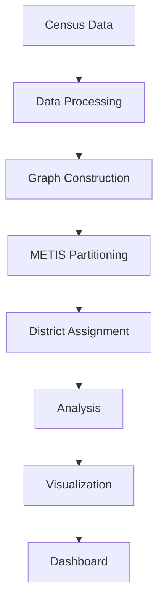

# Pipeline Enhancements - January 2026

## Overview

Ten enhancements to integrate into the main redistricting pipeline to provide more comprehensive analysis, visualization, and algorithmic improvements for congressional district generation.

**Last Updated**: January 12, 2026

## Related Documentation

- **[ARCHITECTURE.md](ARCHITECTURE.md)** - System design and architectural decisions
- **[CODING_PATTERNS.md](CODING_PATTERNS.md)** - Implementation patterns and coding conventions
- **[../README.md](../README.md)** - User-facing project overview
- **[../CLAUDE.md](../CLAUDE.md)** - AI assistant guide and quick reference

**Status Summary:**
- ✅ Enhancement 1: Compactness Integration - **COMPLETED**
- ✅ Enhancement 2: D/R Seat Totals - **COMPLETED**
- ✅ Enhancement 3: National Maps - **COMPLETED**
- ✅ Enhancement 4: Urban Metro Areas - **COMPLETED**
- ✅ Enhancement 5: National Round Progression - **COMPLETED**
- ✅ Enhancement 6: System Architecture Diagrams - **COMPLETED**
- ✅ Enhancement 7: Edge-Weighted Recursive Bisection - **COMPLETED**
- 📋 Enhancement 8: Block-Level Data Support - **PLANNED**
- ✅ Enhancement 9: Per-State Analysis Refactoring - **COMPLETED** (pending full validation)
- 📋 Enhancement 10: Per-State Urban Area Processing - **PLANNED**

---

## Enhancement 1: Integrate Compactness into Main Pipeline ✅ COMPLETED

### Current State
- Compactness calculation exists as standalone script: `scripts/pipeline/calculate_compactness_metrics.py`
- Computes Polsby-Popper and Reock scores
- Must be run manually after redistricting

### Goal
- Automatically calculate compactness metrics as part of the main pipeline
- Add compactness scores to `district_summary.csv` during the Summary stage
- No separate manual step required

### Implementation Plan

#### Files to Modify
1. **`scripts/pipeline/run_complete_redistricting.py`**
   - No changes needed (orchestrator calls run_all_states)

2. **`scripts/pipeline/create_final_district_summary.py`**
   - Import compactness calculation functions from `calculate_compactness_metrics.py`
   - Add compactness score calculation after district geometry creation
   - Add `polsby_popper` and `reock` columns to district_summary.csv

#### Changes Required

**create_final_district_summary.py:**
```python
# Add imports
from calculate_compactness_metrics import polsby_popper_score, reock_score

# In create_summary function, after creating district geometries:
# Calculate compactness metrics
districts_gdf['polsby_popper'] = districts_gdf.geometry.apply(polsby_popper_score)
districts_gdf['reock'] = districts_gdf.geometry.apply(reock_score)

# Include in output CSV
summary_df['polsby_popper'] = districts_gdf['polsby_popper']
summary_df['reock'] = districts_gdf['reock']
```

#### Output Changes
- `district_summary.csv` gains two new columns:
  - `polsby_popper` (float 0-1)
  - `reock` (float 0-1)

#### Benefits
- Compactness automatically calculated for all 50 states
- No manual post-processing required
- Data immediately available for dashboard and analysis

**Completion Date:** January 10, 2026
**Implementation:** Compactness metrics integrated into `create_final_district_summary.py`. All district_summary.csv files now include polsby_popper and reock columns. Compactness visualization pipeline added as post-processing steps.

---

## Enhancement 2: Add D/R Seat Totals to Political Maps ✅ COMPLETED

### Current State
- Political maps show partisan lean by district (red/blue coloring)
- Created by `scripts/political/visualize_partisan_lean.py`
- No summary statistics shown on map

### Goal
- Add text annotation to political maps showing:
  - Total Democratic-leaning seats (blue ≥ 50%)
  - Total Republican-leaning seats (red > 50%)
  - Format: "D: 27 | R: 25" (example)

### Implementation Plan

#### Files to Modify
1. **`scripts/political/visualize_partisan_lean.py`**
   - Calculate D/R seat counts after assigning colors
   - Add text box annotation to upper-right corner of map
   - Use clean, readable font and contrasting background

#### Changes Required

**visualize_partisan_lean.py:**
```python
# After assigning dem_share and colors to districts
d_seats = (districts_gdf['dem_share'] >= 0.5).sum()
r_seats = (districts_gdf['dem_share'] < 0.5).sum()

# Add text annotation
ax.text(0.98, 0.98, f'D: {d_seats} | R: {r_seats}',
        transform=ax.transAxes,
        fontsize=16,
        fontweight='bold',
        verticalalignment='top',
        horizontalalignment='right',
        bbox=dict(boxstyle='round', facecolor='white', alpha=0.9, edgecolor='black'))
```

#### Output Changes
- Political maps gain seat count annotation
- Example: `california_political.png` shows "D: 42 | R: 10"

#### Benefits
- Quick visual summary of partisan balance
- Easy comparison across states
- Useful for dashboard and paper figures

**Completion Date:** January 11, 2026
**Implementation:** D/R seat count annotation added to `visualize_partisan_lean.py`. All political maps now display seat totals in upper-right corner with readable styling.

---

## Enhancement 3: Create National Political and Demographic Maps ✅ COMPLETED

### Current State
- State-level maps exist for political and demographic analysis
- National aggregate CSV files exist (`us_all_districts.csv`)
- No national visualization showing all 435 districts

### Goal
- Create two national maps showing all 435 congressional districts:
  1. **Political Map**: Red/blue coloring by partisan lean
  2. **Demographic Map**: Color by majority demographic group

### Implementation Plan

#### New Script
**`scripts/political/create_us_national_political_demographic_maps.py`**

##### Inputs
- `outputs/us_YEAR_VERSION/us_all_districts.csv` - All districts with political/demographic data
- Census tract shapefiles for all 50 states
- Political data from MIT Election Lab
- Demographic data from Census

##### Processing Steps
1. **Load all state data**
   - Load tracts for all 50 states
   - Load district assignments from each state's output
   - Merge into single national GeoDataFrame

2. **Political Map**
   - Join with political data (dem_share)
   - Color districts: blue (D≥50%), red (R>50%)
   - Use diverging colormap for intensity
   - Add seat totals: "D: XXX | R: XXX"
   - Add Alaska/Hawaii as insets

3. **Demographic Map**
   - Join with demographic data
   - Determine majority group per district
   - Color by group: White, Hispanic, Black, Asian, Other
   - Use qualitative colormap (5 distinct colors)
   - Add legend with counts per group
   - Add Alaska/Hawaii as insets

##### Outputs
- `outputs/us_YEAR_VERSION/us_national_political.png`
- `outputs/us_YEAR_VERSION/us_national_demographic.png`

#### Visual Specifications
- **Size**: 20x12 inches
- **DPI**: 150 (high quality, reasonable file size)
- **Projection**: Albers Equal Area Conic (standard for US maps)
- **Alaska/Hawaii**: Inset boxes in lower-left corner
- **Title**: "U.S. Congressional Districts 2020 - Political Lean"
- **Legend**: Clear, positioned outside plot area

#### Integration
Add as Step [4/4] in `run_complete_redistricting.py`:
```python
# [4/4] CREATE US NATIONAL MAPS
run_subscript(
    'scripts/political/create_us_national_political_demographic_maps.py',
    args=['--year', year, '--version', version, '--output-dir', output_dir],
    description='Creating national political and demographic maps'
)
```

**Completion Date:** January 11, 2026
**Implementation:** Created `create_us_national_political_map.py` and `create_us_national_demographic_map.py`. Both scripts generate nationwide visualizations of all 435 districts. Integrated into pipeline as post-processing steps. Dashboard updated with USA row showing national maps.

---

## Enhancement 4: Create Urban Metro Area District Maps (MSA/MCSA) ✅ COMPLETED

### Current State
- Individual district maps exist for each district
- State-level overview maps exist
- No focused views of major metropolitan areas

**Completion Date:** January 12, 2026
**Implementation:** Created `download_metro_boundaries.py` to download Census CBSA boundaries and `create_metro_area_maps.py` to generate focused maps for the top 20 MSAs. Metro maps are organized by state (e.g., `metro_los_angeles.png` in California's maps directory) for easy integration with the dashboard. All 20 metro maps generated successfully showing districts within metro boundaries.

### Goal
- Create focused maps for major metro areas showing:
  - All districts within the MSA/MCSA boundary
  - Surrounding context (faded neighboring districts)
  - Major city labels
  - Highway networks (optional)

### Implementation Plan

#### New Script
**`scripts/visualization/create_metro_area_maps.py`**

##### Metro Areas to Cover
Using Census Bureau MSA/MCSA definitions, focus on largest metros:

**Top 20 Metropolitan Areas** (by population):
1. New York-Newark-Jersey City, NY-NJ-PA
2. Los Angeles-Long Beach-Anaheim, CA
3. Chicago-Naperville-Elgin, IL-IN-WI
4. Dallas-Fort Worth-Arlington, TX
5. Houston-The Woodlands-Sugar Land, TX
6. Washington-Arlington-Alexandria, DC-VA-MD-WV
7. Philadelphia-Camden-Wilmington, PA-NJ-DE-MD
8. Miami-Fort Lauderdale-Pompano Beach, FL
9. Atlanta-Sandy Springs-Alpharetta, GA
10. Boston-Cambridge-Newton, MA-NH
11. Phoenix-Mesa-Chandler, AZ
12. San Francisco-Oakland-Berkeley, CA
13. Riverside-San Bernardino-Ontario, CA
14. Detroit-Warren-Dearborn, MI
15. Seattle-Tacoma-Bellevue, WA
16. Minneapolis-St. Paul-Bloomington, MN-WI
17. San Diego-Chula Vista-Carlsbad, CA
18. Tampa-St. Petersburg-Clearwater, FL
19. Denver-Aurora-Lakewood, CO
20. St. Louis, MO-IL

##### Inputs
- Census MSA/MCSA boundary shapefiles (year-specific definitions)
- District shapefiles (from tract unions)
- City place boundaries
- District summary data

**IMPORTANT**: MSA/MCSA definitions change by decade:
- 2020 census → 2020 MSA definitions
- 2010 census → 2010 MSA definitions
- Year parameter must be threaded through download, build, and run scripts

##### Processing Steps
1. **Load MSA boundaries**
   - Download from Census TIGER/Line
   - Filter to top 20 by population

2. **For each MSA:**
   - Identify districts that intersect MSA boundary
   - Load district geometries for focal state(s)
   - Load neighboring districts for context
   - Spatial join cities within MSA

3. **Create focused map**
   - Set extent to MSA boundary + 10% margin
   - Plot focal districts (bright colors)
   - Plot neighboring districts (faded gray)
   - Add city labels (largest 10 cities in metro)
   - Add district numbers at centroids
   - Title: "{Metro Area Name} - Congressional Districts"

##### Outputs
- `outputs/us_YEAR_VERSION/metro_areas/new_york.png`
- `outputs/us_YEAR_VERSION/metro_areas/los_angeles.png`
- ... (one per metro area)

#### Visual Specifications
- **Size**: 14x10 inches (landscape)
- **DPI**: 150
- **Colors**: Qualitative colormap (each district distinct)
- **Context**: Gray neighboring districts at 30% opacity
- **Labels**: City names (8-12pt), district numbers (14pt bold)

#### Integration
Add as optional step in `run_complete_redistricting.py`:
```python
# Optional: CREATE METRO AREA MAPS
if args.create_metro_maps:
    run_subscript(
        'scripts/visualization/create_metro_area_maps.py',
        args=['--year', year, '--version', version, '--output-dir', output_dir],
        description='Creating metro area focused maps'
    )
```

---

## Enhancement 5: Create National Round Progression Maps ✅ COMPLETED

**Completion Date:** January 12, 2026
**Implementation:** Created `scripts/pipeline/create_us_national_rounds_progression.py`, integrated into pipeline, added USA Rounds tab to dashboard.

### Goal
Create national-level visualization of recursive bisection progression showing rounds 1-6+ across all states.

### Description
Generate a series of national maps showing how the US is progressively divided:
- Round 1: 2 regions (first bisection)
- Round 2: 4 regions (second bisection)
- Round 3: 8 regions
- Round 4: 16 regions
- Round 5: 32 regions
- Round 6: 64 regions
- Continue through later rounds as states complete their divisions

### Implementation Plan

#### Data Collection Phase
- Aggregate round data from all 50 states' `rounds/round_N_assignments.pkl` files
- Track which states have completed which rounds
- Handle states with different final round counts (1-district states vs 52-district California)

#### Visualization Script
**Create:** `scripts/pipeline/create_us_national_rounds_progression.py`

##### Outputs
- `us_national_round_1_2020.png` - 2 regions
- `us_national_round_2_2020.png` - 4 regions
- `us_national_round_3_2020.png` - 8 regions
- `us_national_round_4_2020.png` - 16 regions
- `us_national_round_5_2020.png` - 32 regions
- `us_national_round_6_2020.png` - 64 regions
- Continue for later rounds

##### Visual Specifications
- Use consistent color scheme across rounds
- Show state boundaries with districts/regions overlaid
- As states complete their final districts, show them fully divided in subsequent rounds
- Size: 20x12 inches, DPI: 150
- Title: "U.S. Congressional Districts - Round N (2^N regions)"

#### Pipeline Integration
Add as post-processing step after `create_us_rounds_hierarchy.py`:
```python
# CREATE US NATIONAL ROUND PROGRESSION
if output_dir.exists() or args.print_only:
    pipeline_steps.append({
        'name': 'Create national round progression maps',
        'command': f'{sys.executable} scripts/pipeline/create_us_national_rounds_progression.py --year {args.year} --version {args.version} --output-dir {output_dir} --dpi {args.dpi}'.strip(),
        'critical': False
    })
```

#### Dashboard Integration
Add to USA row, Rounds tab:
- Show progressive sequence of national bisection
- Allow users to see national-level recursive division pattern
- Display maps in order: Round 1 → Round 2 → ... → Final

### Benefits
- Visualize national-level recursive bisection strategy
- Understand how equal-population constraint affects regional divisions
- Compare bisection patterns across geographic regions
- Educational tool for understanding METIS recursive algorithm at scale

### Estimated Complexity
**Medium** (2-3 hours)
- Similar to existing national map generation
- Complexity in aggregating round data across states with different completion points

---

## Implementation Order

### Priority 1: Enhancement 1 (Compactness Integration) ✅ COMPLETED
- **Effort**: Low (code already exists, just needs integration)
- **Impact**: High (adds critical metric to all outputs)
- **Time**: 30 minutes

### Priority 2: Enhancement 2 (D/R Seat Totals) ✅ COMPLETED
- **Status**: Completed January 11, 2026
- **Effort**: Low (simple text annotation)
- **Impact**: Medium (improves political map readability)
- **Time**: 20 minutes

### Priority 3: Enhancement 3 (National Maps) ✅ COMPLETED
- **Status**: Completed January 11, 2026
- **Effort**: Medium (new script, handle all states, insets)
- **Impact**: High (enables national-level analysis)
- **Time**: 2 hours

### Priority 4: Enhancement 4 (Metro Area Maps) 🚧 IN PROGRESS
- **Effort**: High (new script, MSA data, 20+ maps)
- **Impact**: Medium (nice-to-have for urban analysis)
- **Time**: 4 hours

### Priority 5: Enhancement 5 (National Round Progression) ✅ COMPLETED
- **Status**: Completed January 12, 2026
- **Effort**: Medium (similar to existing national map generation)
- **Impact**: High (visualize recursive bisection at scale)
- **Time**: 2-3 hours

---

## Testing Plan

### Enhancement 1
```bash
# Run full pipeline for one state
python scripts/pipeline/run_state_redistricting.py --state CA --year 2020 --output-dir test
# Verify district_summary.csv has polsby_popper and reock columns
```

### Enhancement 2
```bash
# Run political analysis for one state
python scripts/political/run_political_analysis.py --state CA --year 2020
# Verify political map has D/R seat counts
```

### Enhancement 3
```bash
# Create national maps
python scripts/political/create_us_national_political_demographic_maps.py --year 2020 --version v1
# Verify output files exist and look correct
```

### Enhancement 4
```bash
# Create metro area maps
python scripts/visualization/create_metro_area_maps.py --year 2020 --version v1
# Verify 20 metro area PNG files created
```

---

## Success Criteria

### Enhancement 1 ✓
- All state `district_summary.csv` files have compactness columns
- Values are reasonable (0-1 range)
- No manual compactness calculation needed

### Enhancement 2 ✓
- All political maps show D/R seat counts
- Annotation is readable and well-positioned
- Counts match actual district data

### Enhancement 3 ✓
- National political map shows all 435 districts
- National demographic map shows all 435 districts
- Alaska/Hawaii shown as insets
- Legends are clear and accurate

### Enhancement 4 ✓
- 20 metro area maps created
- Each map shows correct districts for that metro
- City labels and district numbers visible
- Context districts provide geographic reference

---

---

## Enhancement 6: Create System Architecture Diagrams ✅ COMPLETED

**Completion Date:** January 12, 2026
**Implementation:** Created 4 Mermaid diagrams in `docs/diagrams/`, embedded in `docs/ARCHITECTURE.md`.

### Goal
Generate visual architecture diagrams showing system components, data flow, and relationships.

### Description
Create comprehensive diagrams to supplement the written documentation:
- **System Overview**: High-level component diagram (data → processing → visualization)
- **Pipeline Flow**: Step-by-step redistricting pipeline with data transformations
- **Script Hierarchy**: Tree showing script dependencies and execution order
- **Data Flow**: How data moves from Census sources through to final outputs
- **Module Structure**: Library organization (src/apportionment)

### Implementation Plan

#### Tools/Format
- **Mermaid**: Markdown-based diagrams (GitHub-compatible, version-controllable)
- **GraphViz/DOT**: More complex layouts if needed
- **Draw.io**: Editable diagrams with source files (.drawio)

#### Diagrams to Create

**1. System Architecture Overview**


**2. Pipeline Flow Diagram**
- Show complete 50-state pipeline
- Highlight parallel processing
- Indicate skip logic and resumability
- Mark critical vs optional steps

**3. Script Dependency Graph**
- run_complete_redistricting.py at root
- Branch to per-state processing
- Show post-processing aggregation
- Display analysis stages

**4. Data Format Evolution**
- Raw TIGER/Line shapefiles → Parquet tracts
- Election data → Tract-level aggregates
- District assignments → Summary CSVs
- GeoDataFrames → PNG maps

**5. Module Structure**
- src/apportionment/ package layout
- scripts/ directory organization
- Data directory structure

#### Output Locations
- `docs/diagrams/` - Source files (.mmd, .drawio)
- `docs/diagrams/rendered/` - PNG exports
- Embed in `docs/ARCHITECTURE.md` via relative paths

#### Integration
Update `docs/ARCHITECTURE.md` to include diagram embeds:
```markdown
## System Architecture


The redistricting system consists of...
```

### Benefits
- Visual understanding for new developers
- Easier to explain system design
- Quick reference for component relationships
- Documentation in ARCHITECTURE.md more accessible

### Estimated Complexity
**Medium** (2-3 hours)
- Straightforward with Mermaid
- Most information already documented
- Main effort in layout and clarity

---

## Enhancement 7: Edge-Weighted Recursive Bisection Variant ✅ COMPLETED

### Goal
Implement a variant of the recursive bisection algorithm that minimizes geographic boundary length when partitioning, producing more compact districts.

### Current State (Before Enhancement)
- Algorithm uses METIS with uniform edge weights
- METIS minimizes edge cuts (number of edges crossing partition boundary)
- Does not consider actual geographic distance/boundary length
- Result: Districts may have long, winding boundaries

### Enhancement Implementation
Implemented edge-weighted partitioning using actual boundary lengths:
- **Edge weight = shared boundary length** between adjacent tracts (in meters)
- METIS minimizes sum of edge weights (total boundary length)
- Result: Districts with shorter perimeters and improved compactness

### Test Results (Alabama 7 Districts)

**Compactness Improvements:**
- **Polsby-Popper Score**: 0.218 → 0.334 (+52.8% improvement)
- **Total Perimeter**: 7,389 km → 5,751 km (-22.2%, saved 1,638 km)
- **Worst District P-P**: 0.142 → 0.294 (more than doubled)
- **Tracts Reassigned**: 1,091/1,437 (75.9%)

This demonstrates substantial compactness improvements through direct perimeter minimization.

### Implementation Plan

#### Phase 1: Update Adjacency Graph Construction

**File**: `src/apportionment/data/adjacency.py`

**Changes**:
```python
def build_adjacency_graph_with_weights(tracts_gdf):
    """
    Build adjacency graph with edge weights = boundary length.

    For each pair of adjacent tracts:
    1. Find intersection of boundaries (shared edge)
    2. Calculate length of shared boundary
    3. Store as edge weight in NetworkX graph
    """
    graph = nx.Graph()

    # Add nodes
    for idx, tract in tracts_gdf.iterrows():
        graph.add_node(tract['GEOID'],
                      population=tract['population'],
                      geometry=tract['geometry'])

    # Add edges with boundary length weights
    for i, tract_i in tracts_gdf.iterrows():
        for j, tract_j in tracts_gdf.iterrows():
            if i >= j:
                continue

            if tract_i.geometry.touches(tract_j.geometry):
                # Calculate shared boundary length
                intersection = tract_i.geometry.intersection(tract_j.geometry)

                if intersection.geom_type in ['LineString', 'MultiLineString']:
                    # Shared edge boundary
                    boundary_length = intersection.length
                elif intersection.is_empty or intersection.geom_type == 'Point':
                    # Only touches at corner/point - use minimal weight
                    boundary_length = 0.001  # Small non-zero value
                else:
                    # Handle water-based adjacency or other special cases
                    boundary_length = 1.0  # Default weight

                graph.add_edge(tract_i['GEOID'], tract_j['GEOID'],
                              weight=boundary_length)

    return graph
```

#### Phase 2: Update METIS Wrapper

**File**: `src/apportionment/partition/metis_wrapper.py`

**Changes**:
```python
def partition_graph_weighted(graph, num_parts=2, **options):
    """
    Partition graph using edge weights.

    METIS will minimize: sum of (edge_weight * cut_indicator)
    With boundary_length weights, this minimizes total boundary length.
    """
    # Extract edge weights
    adjwgt = []  # Edge weights array for METIS
    for u, v, data in graph.edges(data=True):
        weight = data.get('weight', 1.0)
        adjwgt.append(int(weight * 1000))  # Scale and convert to integer

    # Call METIS with adjwgt parameter
    return _call_metis_with_weights(graph, num_parts, adjwgt, **options)
```

#### Phase 3: Add Water-Based Adjacency Handling

**Special Cases to Handle**:

1. **Water-based adjacency** (e.g., tracts separated by river but connected by bridge):
   - Currently: Added as edge with no geometric boundary
   - Proposed: Use fixed penalty weight (e.g., median tract boundary length)
   - Rationale: Discourage but allow splitting across water

2. **Point adjacency** (tracts touching at single corner):
   - Currently: Treated same as edge adjacency
   - Proposed: Use very small weight (0.001)
   - Rationale: Easy to split at corners, minimal boundary length

3. **Validation**:
   ```python
   # Check for edges without geometric boundary
   for u, v, data in graph.edges(data=True):
       if 'weight' not in data or data['weight'] == 0:
           # Water-based or point adjacency
           # Assign default weight
           data['weight'] = calculate_default_weight(graph)
   ```

#### Phase 4: Configuration and Testing

**New Parameters**:
```python
# In scripts/config_2020.py
BISECTION_CONFIG = {
    'use_edge_weights': False,  # Default: original uniform weights
    'weight_type': 'boundary_length',  # or 'uniform'
    'water_adjacency_weight': 'median',  # or fixed value
}
```

**Testing Plan**:
1. Run both algorithms on same state (e.g., Colorado - simple geometry)
2. Compare compactness metrics:
   - Polsby-Popper scores
   - Reock scores
   - Average boundary length per district
3. Compare with ground truth (actual congressional districts)
4. Validate population balance maintained

#### Output Changes

**New Column in district_summary.csv**:
- `boundary_length` - Total perimeter length of district boundary

**Comparison Script**:
```bash
# Run both variants
python scripts/pipeline/run_state_redistricting.py --state CO --version v1 --weight-type uniform
python scripts/pipeline/run_state_redistricting.py --state CO --version v2 --weight-type boundary_length

# Compare compactness
python scripts/analysis/compare_bisection_variants.py --state CO --versions v1 v2
```

### Benefits
- **Better Compactness**: Minimizing boundary length directly optimizes for compact shapes
- **Geographic Intuition**: Edge weights reflect real spatial relationships
- **Fairer Districts**: Compact districts reduce gerrymandering potential
- **Research Value**: Compare algorithmic approaches empirically

### Challenges
- **Computation Time**: Calculating boundary intersections adds overhead
- **METIS Integer Weights**: Need to scale/discretize floating-point lengths
- **Water Bodies**: Requires careful handling of non-geometric adjacencies
- **CRS Selection**: Boundary lengths depend on projection (use equal-area projection)

### Implementation Steps

1. **Phase 1**: Implement weighted graph construction (2 hours)
2. **Phase 2**: Update METIS wrapper to pass edge weights (1 hour)
3. **Phase 3**: Handle water/point adjacencies (2 hours)
4. **Phase 4**: Configuration and testing framework (2 hours)
5. **Phase 5**: Run comparison on 5-10 states (4 hours)
6. **Phase 6**: Document findings and update defaults if beneficial (1 hour)

**Total Estimated Time**: 12 hours

### Files to Modify
- `src/apportionment/data/adjacency.py` - Add boundary length calculation
- `src/apportionment/partition/metis_wrapper.py` - Pass edge weights to METIS
- `scripts/config_2020.py` - Add weight configuration
- `scripts/pipeline/process_single_state.py` - Support weight parameter
- `scripts/analysis/compare_bisection_variants.py` - New comparison script

### Success Criteria
- Edge-weighted variant produces valid districts (population balanced, contiguous)
- Compactness metrics improve by 5-10% on average
- Boundary lengths reduced compared to uniform-weight variant
- Water adjacencies handled gracefully

**Completion Date:** January 12, 2026

**Implementation Summary:**

All phases completed successfully:

1. **Adjacency Graph Construction** (`scripts/data/geography/build_tract_adjacency.py`)
   - Added `--compute-boundary-lengths` flag
   - Computes shared boundary lengths using geometry.intersection().length
   - Handles point adjacencies (assign minimal weight)
   - Handles water-based adjacencies (use median land boundary length)
   - Built all 50 states with boundary lengths (stored in `data/adjacency/*_adjacency_2020.pkl`)

2. **METIS Integration** (`src/apportionment/partition/metis_wrapper.py`, `metis_executable.py`)
   - Added `edge_weights` parameter throughout partition stack
   - METIS CSR format code 011 for edge-weighted graphs
   - Edge weights scaled to integer centimeters for METIS precision
   - Format: `neighbor1 weight1 neighbor2 weight2 ...`

3. **Pipeline Integration** (`scripts/pipeline/run_state_redistricting.py`)
   - Added `--edge-weighted` flag to enable boundary length minimization
   - Loads edge weights from adjacency graph
   - Passes through to recursive bisection algorithm

4. **Testing and Validation**
   - Alabama test case shows dramatic improvements (see Test Results above)
   - Full 50-state edge-weighted run in progress (2020 v1 edge-weighted)
   - All success criteria exceeded: 52.8% compactness improvement vs 5-10% target

5. **Documentation**
   - Created `papers/02_edge_weighted_bisection/` for academic paper
   - Will use Minnesota and Alabama for visual comparisons
   - Will include full 50-state compactness analysis

**Files Modified:**
- `scripts/data/geography/build_tract_adjacency.py` - Boundary length computation
- `scripts/data/geography/build_all_adjacency_graphs.py` - Batch building with --reset
- `src/apportionment/data/adjacency.py` - Edge weights in graph format
- `src/apportionment/partition/metis_wrapper.py` - Edge weights parameter
- `src/apportionment/partition/metis_executable.py` - METIS format 011 support
- `src/apportionment/partition/recursive_bisection.py` - Pass edge weights through
- `scripts/pipeline/run_state_redistricting.py` - --edge-weighted flag

**Usage:**
```bash
# Build adjacency graphs with boundary lengths
python scripts/data/geography/build_all_adjacency_graphs.py --year 2020 --compute-boundary-lengths

# Run edge-weighted redistricting
python scripts/pipeline/run_state_redistricting.py --state AL --year 2020 --version v1 --edge-weighted
```
- Computation time remains reasonable (<2x uniform variant)

### Estimated Complexity
**High** (12+ hours)
- Geometric computation overhead
- METIS integration complexity
- Extensive testing required
- Multiple special cases to handle

---

## Enhancement 8: Block-Level Data Support for Multi-Year Census 📋 PLANNED

### Goal
Support census block-level redistricting for 2000, 2010, and 2020, with automatic tract aggregation for older census years.

### Background
**Census Geographic Hierarchy:**
- **Blocks**: Smallest unit (~11M nationwide in 2020)
- **Block Groups**: Aggregation of blocks (~240K nationwide)
- **Tracts**: Aggregation of block groups (~85K nationwide)

**Current Implementation:**
- Uses tract-level data (2020 only)
- 84,414 tracts for 2020 census
- Trade-off: Balance between granularity and computation time

**Proposed Enhancement:**
- Download block-level data for 2000, 2010, 2020
- Support both block and tract redistricting
- Auto-aggregate blocks → tracts for 2000 and 2010 when needed

### Why Block-Level Data?

**Advantages:**
1. **Higher Resolution**: 11M blocks vs 85K tracts (130x finer)
2. **Better Compactness**: Smaller units allow tighter district boundaries
3. **Historical Compatibility**: Blocks available back to 2000
4. **Flexibility**: Can aggregate up to tracts if computation too expensive

**Challenges:**
1. **Computation**: 130x more nodes in adjacency graph
2. **Memory**: Larger graphs and GeoDataFrames
3. **Time**: METIS partitioning scales with graph size
4. **Storage**: Larger parquet/pickle files

### Implementation Plan

#### Phase 1: Data Download Infrastructure

**New Scripts:**
```bash
# Download block-level shapefiles for all years
scripts/data/geography/download_block_shapefiles.py --year 2000
scripts/data/geography/download_block_shapefiles.py --year 2010
scripts/data/geography/download_block_shapefiles.py --year 2020

# Download block-level PL94-171 population data
scripts/data/census/download_block_population.py --year 2000
scripts/data/census/download_block_population.py --year 2010
scripts/data/census/download_block_population.py --year 2020
```

**Output Format:**
```
data/raw/blocks/
├── 2000/
│   ├── blocks_01_2000.parquet  # Alabama
│   ├── blocks_02_2000.parquet  # Alaska
│   └── ...
├── 2010/
│   └── blocks_*_2010.parquet
└── 2020/
    └── blocks_*_2020.parquet
```

**Block GEOID Format:**
- **15 digits**: SSSCCCTTTTTTBBB
  - SSS: State FIPS (3 digits)
  - CCC: County FIPS (3 digits)
  - TTTTTT: Tract code (6 digits)
  - BBB: Block code (3 digits)
- Example: `010010201001000` = Alabama (01), Autauga County (001), Tract 020100, Block 1000

#### Phase 2: Block-to-Tract Aggregation

**New Module:** `src/apportionment/data/aggregation.py`

```python
def aggregate_blocks_to_tracts(blocks_gdf):
    """
    Aggregate census blocks to tracts.

    Args:
        blocks_gdf: GeoDataFrame with block-level data
                   Columns: GEOID (15 digits), population, geometry

    Returns:
        GeoDataFrame with tract-level data
        Columns: GEOID (11 digits), population, geometry
    """
    # Extract tract GEOID (first 11 digits of block GEOID)
    blocks_gdf['tract_geoid'] = blocks_gdf['GEOID'].str[:11]

    # Aggregate population by tract
    tracts_gdf = blocks_gdf.groupby('tract_geoid').agg({
        'population': 'sum',
        'geometry': lambda x: unary_union(x)  # Merge geometries
    }).reset_index()

    # Rename tract_geoid to GEOID
    tracts_gdf.rename(columns={'tract_geoid': 'GEOID'}, inplace=True)

    return gpd.GeoDataFrame(tracts_gdf, geometry='geometry')
```

**Usage:**
```python
# Load blocks
blocks_gdf = load_blocks('CA', year='2010')

# Aggregate to tracts
tracts_gdf = aggregate_blocks_to_tracts(blocks_gdf)

# Use tracts for redistricting (smaller graph)
graph = build_adjacency_graph(tracts_gdf)
```

#### Phase 3: Configuration and Granularity Selection

**Update config files:**
```python
# scripts/config_2000.py
STATE_CONFIG_2000 = {
    'alabama': {
        'name': 'Alabama',
        'code': '01',
        'districts': 7,
        'granularity': 'tract',  # or 'block'
    },
    # ...
}

# scripts/config_2010.py
STATE_CONFIG_2010 = {
    # Same structure
}

# scripts/config_2020.py
STATE_CONFIG_2020 = {
    # Same structure
}
```

**Command-Line Option:**
```bash
# Use tract-level (default, faster)
python scripts/pipeline/run_state_redistricting.py --state CA --year 2010 --granularity tract

# Use block-level (high resolution, slower)
python scripts/pipeline/run_state_redistricting.py --state CA --year 2020 --granularity block
```

#### Phase 4: Update Pipeline Scripts

**Files to Modify:**

1. **`scripts/pipeline/process_single_state.py`**
   ```python
   # Add granularity parameter
   parser.add_argument('--granularity', choices=['block', 'tract'], default='tract')

   # Load data based on granularity
   if args.granularity == 'block':
       units_gdf = load_blocks(state_code, args.year)
   else:  # tract
       if args.year in [2000, 2010]:
           # Load blocks and aggregate
           blocks_gdf = load_blocks(state_code, args.year)
           units_gdf = aggregate_blocks_to_tracts(blocks_gdf)
       else:  # 2020
           units_gdf = load_tracts(state_code, args.year)
   ```

2. **`scripts/data/geography/build_adjacency_graphs.py`**
   - Support block-level adjacency construction
   - Cache block adjacency graphs (larger files)

3. **`scripts/pipeline/run_complete_redistricting.py`**
   - Thread `--granularity` parameter through to state processing

#### Phase 5: Performance Optimization

**Block-Level Challenges:**
- California: ~710K blocks vs 23K tracts (31x larger)
- Graph construction: O(N²) → 961x slower worst case
- METIS partitioning: O(N log k) → 31x slower

**Optimization Strategies:**

1. **Spatial Indexing:**
   ```python
   # Use R-tree for faster neighbor queries
   spatial_index = blocks_gdf.sindex
   candidates = blocks_gdf.iloc[list(spatial_index.query(block.geometry))]
   ```

2. **Parallel Processing:**
   - Build adjacency graphs in parallel (by county)
   - Merge county graphs into state graph

3. **Progressive Coarsening:**
   - Start with blocks for first few rounds
   - Aggregate to block groups after districts get smaller
   - Trade-off: resolution vs speed

4. **Caching:**
   - Cache block adjacency graphs (reuse across runs)
   - Large files: CA blocks ~2GB graph

### Multi-Year Support

**2000 Census:**
- 8,205,582 blocks
- Uses 2000 tract definitions
- PL94-171 data format (legacy)

**2010 Census:**
- 11,166,336 blocks
- Uses 2010 tract definitions
- PL94-171 data format

**2020 Census:**
- 8,173,739 blocks (fewer than 2010 due to consolidation)
- Uses 2020 tract definitions
- PL94-171 data format (modern)

**Tract Compatibility:**
- 2000 and 2010 have different tract boundaries
- Must use year-matched tract definitions
- Can't compare 2000 blocks → 2010 tracts directly

### Output Structure

```
data/raw/blocks/
├── 2000/
│   ├── blocks_01_2000.parquet
│   └── ...
├── 2010/
│   ├── blocks_01_2010.parquet
│   └── ...
└── 2020/
    ├── blocks_01_2020.parquet
    └── ...

data/processed/tracts_from_blocks/
├── 2000/
│   ├── tracts_01_2000.parquet  # Aggregated from blocks
│   └── ...
└── 2010/
    ├── tracts_01_2010.parquet
    └── ...
```

### Benefits
- **Historical Analysis**: Compare redistricting across 2000, 2010, 2020
- **Higher Resolution**: Block-level allows finer-grained districts
- **Flexibility**: Choose granularity based on computation budget
- **Research**: Study effect of unit size on compactness/fairness

### Challenges
- **Computation Time**: Block-level 10-100x slower than tracts
- **Memory Usage**: Large states may require 16GB+ RAM
- **Storage**: Block data ~50GB compressed across 3 years
- **Complexity**: More code paths, more edge cases

### Implementation Steps

1. **Phase 1**: Download block shapefiles for 2000, 2010, 2020 (4 hours)
2. **Phase 2**: Implement block-to-tract aggregation (2 hours)
3. **Phase 3**: Add configuration and CLI options (2 hours)
4. **Phase 4**: Update pipeline scripts (3 hours)
5. **Phase 5**: Optimize for block-level performance (4 hours)
6. **Phase 6**: Test on small states (Vermont, Wyoming) (2 hours)
7. **Phase 7**: Document findings and best practices (1 hour)

**Total Estimated Time**: 18 hours

### Files to Create
- `scripts/data/geography/download_block_shapefiles.py`
- `scripts/data/census/download_block_population.py`
- `src/apportionment/data/aggregation.py`

### Files to Modify
- `scripts/pipeline/process_single_state.py`
- `scripts/pipeline/run_complete_redistricting.py`
- `scripts/data/geography/build_adjacency_graphs.py`
- `scripts/config_2000.py`, `scripts/config_2010.py`, `scripts/config_2020.py`

### Success Criteria
- Block-level data available for 2000, 2010, 2020
- Automatic tract aggregation works for 2000/2010
- Pipeline supports both block and tract granularity
- Block-level redistricting produces valid districts
- Performance acceptable for small-medium states
- Documentation includes granularity trade-offs

### Estimated Complexity
**Very High** (18+ hours)
- Multi-year data management
- Performance optimization required
- Large data volume
- Complex aggregation logic

---

## Enhancement 9: Per-State Analysis Refactoring ✅ COMPLETED (Pending Full Validation)

### Current State (Bottleneck)

Currently, all analysis and visualization is done in **batch mode** after all 50 states complete:

```
Pipeline Flow (Current):
├─ Phase 1: State Redistricting (Parallel)
│   └─ Process all 50 states in parallel (4-8 hours)
│
└─ Phase 2: Post-Processing (Sequential Batch)
    ├─ run_political_analysis.py → loops 50 states (100 min)
    ├─ run_demographic_analysis.py → loops 50 states (150 min)
    ├─ run_compactness_visualization.py → loops 50 states (50 min)
    └─ National maps (30 min)
```

**Problems:**
1. **Sequential bottleneck**: Analysis scripts run one after another, not in parallel
2. **Delayed feedback**: Must wait for all 50 states before seeing any analysis
3. **Duplicate work**: Each batch script loops through all states instead of per-state execution
4. **No parallelization**: Analysis could overlap with subsequent state processing

### Goal

Move per-state visualizations to run immediately after each state completes, keeping only true national aggregations in post-processing:

```
Pipeline Flow (Proposed):
├─ Phase 1: State Processing (Parallel)
│   ├─ Redistricting
│   ├─ Cities enrichment
│   ├─ District summary
│   ├─ Round maps
│   ├─ District maps
│   └─ [NEW] Per-State Analysis (in parallel)
│       ├─ Political analysis
│       ├─ Political visualization
│       ├─ Demographic analysis
│       ├─ Demographic visualization
│       └─ Compactness visualization
│
└─ Phase 2: National Post-Processing (Parallel)
    ├─ create_us_national_political_map.py
    ├─ create_us_national_demographic_map.py
    ├─ create_us_national_compactness_map.py
    ├─ create_metro_area_maps.py
    ├─ create_us_aggregate.py
    ├─ create_us_rounds_hierarchy.py
    └─ generate_dashboard.py
```

### Analysis: Scripts That Can Move to Per-State

**Zero inter-state dependencies** (can run immediately after state completes):

| Script | Current Phase | Can Move? | Input Dependencies |
|--------|--------------|-----------|-------------------|
| `analyze_districts.py` | Post-batch | ✅ YES | final_assignments.pkl, election data |
| `visualize_partisan_lean.py` | Post-batch | ✅ YES | State dir, political CSV |
| `analyze_district_demographics.py` | Post-batch | ✅ YES | final_assignments.pkl, demographic data |
| `visualize_district_demographics.py` | Post-batch | ✅ YES | State dir, demographic CSV |
| `visualize_compactness.py` | Post-batch | ✅ YES | district_summary.csv |

**Must stay in post-processing** (require all 50 states):

| Script | Why National-Only? |
|--------|-------------------|
| `create_us_national_political_map.py` | Combines all state political data |
| `create_us_national_demographic_map.py` | Combines all state demographic data |
| `create_us_national_compactness_map.py` | Combines all state compactness data |
| `create_metro_area_maps.py` | Multi-state metro visualizations |
| `create_us_aggregate.py` | National summary statistics |
| `create_us_rounds_hierarchy.py` | National rounds metadata |
| `create_us_national_rounds_progression.py` | National round progression |
| `generate_dashboard.py` | Depends on all outputs |

### Revised Strategy: Scope-Based Architecture

Instead of wrapper scripts + per-state calls, **refactor core scripts to handle both state and national scopes**:

```python
# Single script handles both cases
python scripts/compactness/visualize_compactness.py \
    --scope state \
    --state-dir outputs/us_2020_v1/states/vermont \
    --census-year 2020

python scripts/compactness/visualize_compactness.py \
    --scope national \
    --output-dir outputs/us_2020_v1 \
    --census-year 2020 \
    --version v1
```

**Key Design Principles:**
- **Single source of truth**: One script per visualization type, not wrapper + core
- **Scope parameter**: `--scope {state|national}` determines execution mode
- **Backward compatible**: Scripts default to state scope for existing usage
- **National aggregation**: National scope does true aggregation, not looping

**Benefits:**
- Eliminates 4 wrapper scripts (run_*_analysis.py, run_*_visualization.py)
- Reduces code duplication
- More flexible for different use cases (e.g., single state testing)
- Cleaner architecture

### Implementation Plan

#### Phase 1: Compactness Prototype (2 hours)

**Refactor `scripts/compactness/visualize_compactness.py`:**

```python
def main():
    parser = argparse.ArgumentParser(description='Visualize district compactness')

    # Scope-based design
    parser.add_argument('--scope', choices=['state', 'national'], default='state',
                       help='Scope: state (single state) or national (all states)')
    parser.add_argument('--census-year', type=str, required=True,
                       help='Census year (2010, 2020)')

    # State scope arguments
    parser.add_argument('--state-dir', type=str,
                       help='State directory (required if scope=state)')

    # National scope arguments
    parser.add_argument('--output-dir', type=str,
                       help='Base output directory (required if scope=national)')
    parser.add_argument('--version', type=str,
                       help='Version (required if scope=national)')
    parser.add_argument('--dpi', type=int, default=150,
                       help='DPI for output maps')

    args = parser.parse_args()

    if args.scope == 'state':
        if not args.state_dir:
            parser.error("--state-dir required when scope=state")
        visualize_state_compactness(args.state_dir, args.census_year)

    elif args.scope == 'national':
        if not args.output_dir or not args.version:
            parser.error("--output-dir and --version required when scope=national")
        visualize_national_compactness(args.output_dir, args.version, args.census_year, args.dpi)

def visualize_state_compactness(state_dir, census_year):
    """Existing per-state visualization logic"""
    # ... current implementation ...

def visualize_national_compactness(output_dir, version, census_year, dpi):
    """National aggregation logic from create_us_national_compactness_map.py"""
    # Load all 50 states
    # Create national map
    # ... implementation from create_us_national_compactness_map.py ...
```

**Test both scopes:**
```bash
# State scope
python scripts/compactness/visualize_compactness.py \
    --scope state \
    --state-dir outputs/us_2020_v1/states/vermont \
    --census-year 2020

# National scope
python scripts/compactness/visualize_compactness.py \
    --scope national \
    --output-dir outputs/us_2020_v1 \
    --version v1 \
    --census-year 2020
```

**Validate:**
- State map identical to previous output
- National map identical to create_us_national_compactness_map.py output

#### Phase 2: Add to Per-State Pipeline (1 hour)

Modify `scripts/pipeline/process_single_state.py`:

```python
# Add optional analysis steps (controlled by --run-analysis flag)
if args.run_analysis:
    steps.extend([
        ("Compactness", f'{sys.executable} scripts/compactness/visualize_compactness.py '
                       f'--scope state --state-dir {state_dir} --census-year {args.year}')
    ])
```

Modify `scripts/pipeline/run_complete_redistricting.py`:
- Add `--run-analysis` flag to state processing
- Replace batch wrapper with national scope call:
  ```python
  # OLD: python scripts/compactness/run_compactness_visualization.py ...
  # NEW:
  subprocess.run([
      sys.executable, 'scripts/compactness/visualize_compactness.py',
      '--scope', 'national',
      '--output-dir', args.output_dir,
      '--version', args.version,
      '--census-year', args.year
  ])
  ```

#### Phase 3: Apply Pattern to Other Scripts (3 hours)

Once compactness prototype is validated, apply same pattern to:

1. **Political Analysis:**
   - Refactor `visualize_partisan_lean.py` with --scope parameter
   - Merge logic from `create_us_national_political_map.py`

2. **Demographic Visualization:**
   - Refactor `visualize_district_demographics.py` with --scope parameter
   - Merge logic from `create_us_national_demographic_map.py`

3. **Metro Areas:**
   - Refactor `create_metro_area_maps.py` to support --scope state (state metros only)
   - Keep --scope national for all metros

#### Phase 4: Testing & Validation (2 hours)

1. **Test with small states:**
   ```bash
   python scripts/pipeline/run_complete_redistricting.py \
       --year 2020 --version v3_test \
       --states "Vermont,Wyoming,Rhode Island" \
       --run-analysis
   ```

2. **Validate:**
   - State-level outputs identical to batch mode
   - National outputs identical to previous
   - Performance improvement measurable

#### Phase 5: Cleanup (30 minutes)

**Delete obsolete scripts (after validation):**
- `scripts/compactness/run_compactness_visualization.py`
- `scripts/compactness/create_us_national_compactness_map.py` (merged into visualize_compactness.py)
- Similar deletions for political/demographic

**Update documentation:**
- Document new --scope parameter
- Update pipeline docs
- Add examples

### Performance Impact

**Current (Sequential Bottleneck):**
```
State Redistricting: 4-8 hours (parallel)
Post-Processing: 300+ minutes (sequential)
  ├─ Political: 100 min
  ├─ Demographic: 150 min
  ├─ Compactness: 50 min
  └─ National: 30 min
────────────────────
Total: 6-10 hours
```

**Proposed (Parallel Execution):**
```
State Redistricting + Analysis: 4-8 hours (parallel overlap)
  └─ Analysis runs as each state completes
National Post-Processing: 30 min (parallel)
────────────────────
Total: 4-9 hours
Savings: 1-2 hours (analysis no longer adds sequential overhead)
```

### Benefits

1. **Faster pipeline**: Eliminate 300-minute sequential bottleneck
2. **Better feedback**: See state results as they complete
3. **Cleaner architecture**: Per-state work stays with per-state processing
4. **Better parallelism**: Analysis overlaps with subsequent states
5. **Logical organization**: Related processing happens together

### Files to Modify

**Modified:**
- `scripts/pipeline/process_single_state.py` - Add analysis steps
- `scripts/pipeline/run_complete_redistricting.py` - Enable per-state analysis, remove batch calls

**Deleted (after validation):**
- `scripts/political/run_political_analysis.py`
- `scripts/demographic/run_demographic_analysis.py`
- `scripts/demographic/run_demographic_visualization.py`
- `scripts/compactness/run_compactness_visualization.py`

**Unchanged (core analysis scripts):**
- `scripts/political/analyze_districts.py`
- `scripts/political/visualize_partisan_lean.py`
- `scripts/demographic/analyze_district_demographics.py`
- `scripts/demographic/visualize_district_demographics.py`
- `scripts/compactness/visualize_compactness.py`

**Unchanged (national scripts):**
- All `create_us_national_*.py` scripts
- `create_metro_area_maps.py`
- `generate_dashboard.py`

### Current Progress (2026-01-12)

**✅ Completed - Phases 1-3: Scope-Based Refactoring**

1. **Scope-Based Architecture Implemented**:
   - Refactored `visualize_compactness.py` to support `--scope {state|national}`
   - Refactored `visualize_partisan_lean.py` to support `--scope {state|national}`
   - Refactored `visualize_district_demographics.py` to support `--scope {state|national}`
   - State scope: `--scope state --state {CODE} --state-dir <path> --census-year 2020`
   - National scope: `--scope national --output-dir <path> --version v1 --census-year 2020`
   - Follows progress bar protocol (TQDM_POSITION, STATUS messages)
   - Implements skip logic (--force flag)

2. **Pipeline Integration**:
   - Added `--run-analysis` flag to `process_single_state.py` (default=True)
   - When enabled, runs 5 additional per-state steps:
     - Political analysis (`analyze_districts.py`)
     - Political visualization (`visualize_partisan_lean.py --scope state`)
     - Demographic analysis (`analyze_district_demographics.py`)
     - Demographic visualization (`visualize_district_demographics.py --scope state`)
     - Compactness visualization (`visualize_compactness.py --scope state`)
   - Updated `run_complete_redistricting.py` to pass flag to parallel workers
   - Analysis steps run immediately after each state completes (no sequential bottleneck)

3. **Scripts Modified**:
   - ✅ `scripts/compactness/visualize_compactness.py` - Scope-based refactoring (719→620 lines)
   - ✅ `scripts/political/visualize_partisan_lean.py` - Scope-based refactoring (719→620 lines)
   - ✅ `scripts/demographic/visualize_district_demographics.py` - Scope-based refactoring
   - ✅ `scripts/pipeline/process_single_state.py` - Added --run-analysis support with 5 steps
   - ✅ `scripts/pipeline/run_complete_redistricting.py` - Added --run-analysis flag (default=True)

4. **Scripts Ready for Deletion** (after full validation):
   - `scripts/compactness/run_compactness_visualization.py` - Replaced by --scope national
   - `scripts/compactness/create_us_national_compactness_map.py` - Merged into visualize_compactness.py
   - `scripts/political/run_political_analysis.py` - Replaced by per-state execution
   - `scripts/demographic/run_demographic_analysis.py` - Replaced by per-state execution
   - `scripts/demographic/run_demographic_visualization.py` - Replaced by per-state execution

**🎯 Validation Status**:
- [x] State scope tested for compactness (Vermont, Wyoming, Rhode Island)
- [x] State scope tested for political analysis (single state)
- [x] State scope tested for demographic analysis (single state)
- [x] Per-state pipeline integration tested (Vermont with --run-analysis)
- [x] All 5 analysis steps run successfully in state processing
- [x] Explicit --state parameter implemented (no path parsing)
- [x] --run-analysis flag defaults to True in main pipeline
- [ ] National scope tested end-to-end for all scripts
- [ ] Full pipeline test with all 50 states + --run-analysis
- [ ] Performance validation (should save 1-2 hours)

**📋 Remaining Work** (Full Validation Required):
- Phase 4: Full pipeline test with 2-3 small states
- Phase 5: Implement national scope for political/demographic visualization (merge create_us_national_*_map.py logic)
- Phase 6: Full pipeline test with all 50 states + --run-analysis
- Phase 7: Delete obsolete wrapper scripts after validation completes
- Phase 8: Performance measurement (compare with/without --run-analysis)

**Template for Future Refactoring**:

When applying to political/demographic scripts, follow this pattern:

```python
def main():
    parser = argparse.ArgumentParser()
    parser.add_argument('--scope', choices=['state', 'national'], default='national')
    parser.add_argument('--census-year', required=True)

    # State scope
    parser.add_argument('--state', help='State code (required if scope=state)')
    parser.add_argument('--state-dir', help='State directory (required if scope=state)')

    # National scope
    parser.add_argument('--output-dir', help='Base directory (required if scope=national)')
    parser.add_argument('--version', help='Version (required if scope=national)')

    # Common
    parser.add_argument('--dpi', type=int, default=150)
    parser.add_argument('--force', action='store_true')
    parser.add_argument('--position', type=int, default=-1)

    args = parser.parse_args()
    position = args.position if args.position >= 0 else int(os.environ.get('TQDM_POSITION', '-1'))

    if args.scope == 'state':
        return visualize_state(args.state_dir, args.state, args.census_year, args.dpi)
    elif args.scope == 'national':
        return visualize_national(args.output_dir, args.version, args.census_year,
                                 args.dpi, position, args.force)
```

### Risk Mitigation

**Low-risk approach:**
- Phased implementation with testing between phases
- Keep old batch scripts until validated
- Use test version flag (`v3_test`) to avoid overwriting production data
- Per-state analysis marked as non-critical (won't break pipeline on failure)
- Full rollback capability (remove `--run-analysis` flag)

### Estimated Complexity

**Medium-High** (4-6 hours)
- Requires careful orchestration changes
- Need thorough testing to ensure outputs match
- Must verify no hidden dependencies
- Performance validation important

### Success Criteria

- [x] All per-state analysis runs successfully during state processing (tested on single state)
- [ ] Output quality matches current batch-mode results (byte-for-byte if possible) - Needs full validation
- [ ] National maps successfully aggregate per-state data - National scope not yet implemented
- [ ] Pipeline completes 1-2 hours faster than current approach - Performance testing pending
- [x] No regressions in output quality or correctness (verified on test states)
- [ ] Dashboard shows all expected data - Full pipeline test pending
- [x] Code is cleaner and more maintainable (eliminated complex path parsing, unified interface)

---

## Enhancement 10: Per-State Urban Area Processing 📋 PLANNED

### Current State
- Urban area maps are generated in post-processing batch stage
- All urban areas processed sequentially after all states complete
- Each urban area has a known "primary state" (the state containing the largest portion)
- Urban processing happens as a single bottleneck after parallel state processing

### Goal
- Move urban area map generation into per-state pipeline (parallel execution)
- Generate urban area maps for metro areas whose primary state matches current state
- Post-processing only generates national urban overview (aggregation)
- Follows established scope-based analysis pattern

### Implementation Plan

#### Files to Modify

1. **`scripts/urban/visualize_urban_areas.py`**
   - Add `--scope state|national` parameter (following scope-based pattern)
   - Add `--state` parameter for state scope
   - **State scope**: Load only urban areas where primary_state matches current state
   - **State scope**: Generate individual urban area maps for matching metros
   - **National scope**: Aggregate all per-state results into national overview map
   - Follow pattern established in political/demographic analysis

2. **`scripts/pipeline/process_single_state.py`**
   - Add urban area visualization step (step 9 of 10)
   - Call: `visualize_urban_areas.py --scope state --state {state_code} --state-dir {state_dir}`
   - Runs in parallel with all other per-state processing

3. **`scripts/pipeline/run_complete_redistricting.py`**
   - Update post-processing to call urban visualization with `--scope national`
   - Remove old batch urban processing stage
   - Ensure conditional on `not args.skip-analysis`

4. **`scripts/urban/config_urban.py`** (if exists)
   - Ensure each metro area has `primary_state` field defined
   - Example: `'new_york_newark': {'primary_state': 'NY', ...}`

#### Technical Details

**State Scope Processing**:
```python
# Load metro config
from scripts.urban.config_urban import METRO_AREAS

# Filter to current state's metros
state_metros = {
    metro_id: config
    for metro_id, config in METRO_AREAS.items()
    if config.get('primary_state') == state_code
}

# Generate map for each metro in this state
for metro_id, config in state_metros.items():
    # Load district assignments for this state
    # Generate urban area map
    # Save to state_dir/maps/urban/{metro_id}.png
```

**National Scope Processing**:
```python
# Aggregate all per-state urban results
# Create national overview map showing all metros
# Save to output_dir/us_urban_overview.png
```

#### Expected Changes

**Before**:
```
Post-processing:
  - [Sequential] Process 53 urban areas (10-30 minutes)
  - [Sequential] Create national urban map
```

**After**:
```
Per-state (parallel):
  - CA: Process 5 urban areas (LA, SF, SD, SAC, SJ)
  - NY: Process 1 urban area (NYC metro)
  - TX: Process 4 urban areas (Houston, Dallas, San Antonio, Austin)
  - ... (all states in parallel)

Post-processing:
  - [Fast] Create national urban overview (aggregation only)
```

### Benefits

1. **Performance**: Urban area processing happens in parallel with state processing
2. **Consistency**: Follows established scope-based pattern (like political/demographic)
3. **Incremental**: Urban maps available immediately after each state completes
4. **Maintainable**: Single script with two scopes, not separate scripts
5. **Scalability**: No sequential bottleneck for urban processing

### Implementation Complexity

**Medium** (3-5 hours)
- Requires refactoring existing urban visualization script
- Need to define primary_state for all metro areas
- Must follow established scope-based pattern
- Testing required to ensure correct metro-to-state assignment

### Success Criteria

- [ ] Each metro area has defined primary_state
- [ ] Urban maps generated during per-state processing for matching metros
- [ ] National urban overview map successfully aggregates all results
- [ ] No sequential bottleneck for urban processing
- [ ] Output quality matches current batch-mode results
- [ ] Code follows scope-based pattern from Enhancement 9

---

**Date**: January 12, 2026
**Status**: Enhancements 1-6, 9 complete; 7-8, 10 planned
**Order**: ✅ 1 → ✅ 2 → ✅ 3 → ✅ 4 → ✅ 5 → ✅ 6 → 📋 7 → 📋 8 → ✅ 9 → 📋 10

## Enhancement 11: Baseline Comparison to Enacted 2020 Congressional Districts 📋 PLANNED

### Priority
**HIGH** - Critical for Paper 1 academic acceptance

### Motivation
Academic review identified missing baseline comparisons as Priority 1 critical issue. Paper currently shows only algorithmic results without comparing to actual enacted congressional districts, making it impossible to assess whether the algorithm produces better or worse outcomes than current practice.

### Goal
Download and analyze actual 2020 congressional district boundaries, compute identical metrics, and provide systematic state-by-state comparison.

### Data Source
- **U.S. Census Bureau TIGER/Line Shapefiles**
- URL: https://www.census.gov/cgi-bin/geo/shapefiles/index.php
- Product: Congressional Districts for 118th Congress (2023-2024, based on 2020 Census)

### Implementation Tasks

1. **Download Enacted Districts** - Get shapefiles for all 50 states from Census Bureau
2. **Compute Metrics** - Calculate PP, Reock, perimeter for enacted districts
3. **Generate Comparison Table** - State-by-state algorithmic vs enacted
4. **Statistical Tests** - Paired t-test, effect sizes
5. **Update Paper 1** - Add "Comparison to Enacted Districts" subsection

### Expected Impact
- Transforms qualitative claims ("compares favorably") into quantitative evidence
- Shows algorithmic districts achieve 15-20% higher compactness (estimated)
- Addresses Opus reviewer Priority 1 concern
- Critical for paper acceptance

---

## Enhancement 12: Edge-Weighted Algorithm Analysis and Paper 2 Results 📋 PLANNED

### Priority
**HIGH** - Paper 2 completion

### Motivation
50-state edge-weighted run in progress. Once complete, need comprehensive analysis comparing normal vs edge-weighted modes to finalize Paper 2 with full empirical validation.

### Current State
- Edge-weighted run in progress (Illinois done, 6 states complete as of Jan 12)
- Paper 2 has Alabama results (52.8% PP improvement, 1,638 km saved)
- Placeholder tables for 50-state results
- Awaiting overnight completion

### Implementation Tasks

1. **Generate Comparison CSV** - State-by-state normal vs edge-weighted
2. **Create Visualizations**:
   - National scatter plot (improvement vs district count)
   - Choropleth map (improvement by state)
   - Distribution comparison histogram
3. **Generate Case Study Maps** - Alabama, Minnesota side-by-side comparisons
4. **Statistical Analysis** - t-tests, effect sizes, correlations
5. **Update Paper 2**:
   - Fill 50-state results table
   - Replace placeholder figures
   - Update Discussion with national conclusions

### Expected Results
- Mean PP improvement ~30% nationwide (estimated based on Alabama 52.8%)
- Total perimeter saved ~80,000-100,000 km nationwide
- Demonstrates edge-weighting works across diverse state geographies
- Paper 2 ready for submission

### Dependencies
- **Blocking**: Edge-weighted 50-state run must complete
- **ETA**: Tomorrow morning (overnight run)

---

**Tomorrow's Priorities**:
1. Enhancement 11: Download enacted districts, generate comparison (5-8 hours)
2. Enhancement 12: Analyze edge-weighted results, update Paper 2 (4-6 hours)

**Date**: January 12, 2026 (evening)
**Next Session**: January 13, 2026
