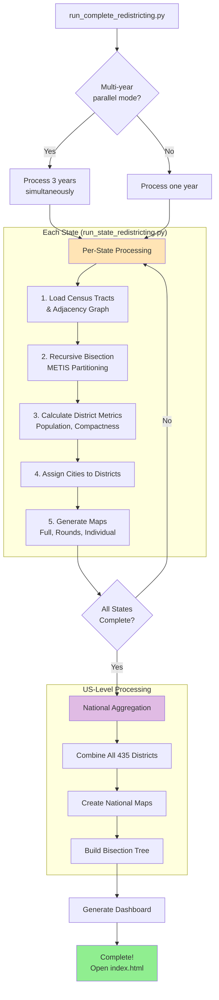
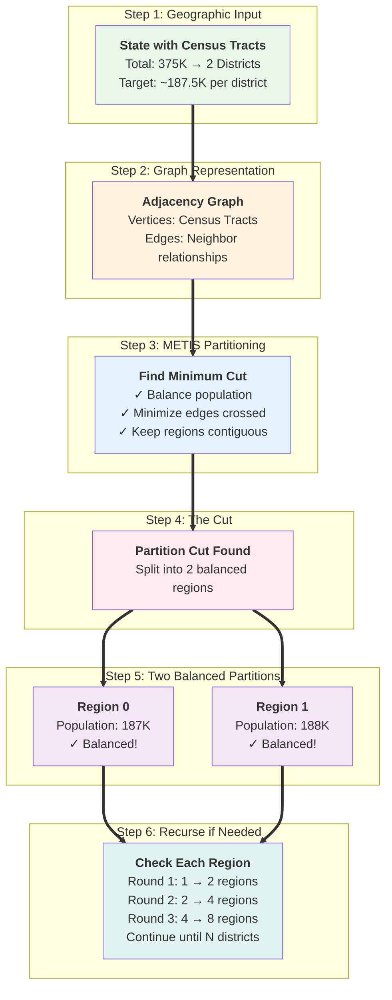

# Getting Started Guide

**Last Updated**: January 17, 2026

This guide will walk you through setting up and running the Congressional Redistricting System for the first time. By the end, you'll have generated your first redistricting maps.

## Table of Contents

- [Prerequisites](#prerequisites)
- [Installation](#installation)
- [Quick Start](#quick-start)
- [Understanding the Output](#understanding-the-output)
- [Next Steps](#next-steps)

## Prerequisites

Before you begin, ensure you have:

### Required Software

**1. Python 3.13 or higher**
```bash
python --version
# Should show: Python 3.13.x or higher
```

**Download**: https://www.python.org/downloads/

**2. METIS Graph Partitioning Library**

METIS is the core algorithm used for redistricting. Installation varies by platform:

**Windows (easiest with Conda)**:
```bash
# Install Conda: https://docs.conda.io/en/latest/miniconda.html
conda install -c conda-forge metis
```

**macOS (with Homebrew)**:
```bash
brew install metis
```

**Linux (Ubuntu/Debian)**:
```bash
sudo apt-get install libmetis-dev
```

**Linux (RHEL/CentOS)**:
```bash
sudo yum install metis-devel
```

**Verify installation**:
```bash
gpmetis --help
# Should display METIS help message
```

### Recommended Specs

For best performance:
- **RAM**: 16 GB (8 GB minimum)
- **Disk Space**: 60 GB free (40 GB data + 20 GB outputs)
- **Storage**: SSD recommended (HDD will be slower)
- **Processors**: 4+ cores (12+ cores optimal for parallel processing)

### Time Expectations

| Task | Time Required |
|------|---------------|
| Installation | 15-30 minutes |
| Data download (single state) | 5-10 minutes |
| Data download (all 50 states) | 30-60 minutes |
| Single state redistricting | 2-5 minutes |
| Full 50-state run (single year) | 1-2 hours |
| Full 50-state run (all 3 years) | 2-4 hours |

## Installation

### Step 1: Clone the Repository

```bash
git clone https://github.com/yourusername/apportionment.git
cd apportionment
```

### Step 2: Install Python Dependencies

**Option A: Using pip (recommended)**
```bash
pip install -r requirements.txt
```

**Option B: Using conda**
```bash
conda env create -f environment.yml
conda activate redistricting
```

**Verify installation**:
```bash
python -c "import geopandas; print('GeoPandas:', geopandas.__version__)"
python -c "import pymetis; print('PyMETIS: OK')"
```

**Common issues**: See [TROUBLESHOOTING.md](TROUBLESHOOTING.md) if you encounter errors.

### Step 3: Verify Installation

Run the test suite to ensure everything is working:

```bash
pytest tests/ -v
```

**Expected result**: All tests pass in ~18 seconds.

If tests fail, see [TROUBLESHOOTING.md](TROUBLESHOOTING.md).

## Quick Start

Let's run your first redistricting analysis. We'll start with a small state to ensure everything works.

### Option 1: Single Small State (Fastest - 2 minutes)

**Vermont** has only 1 congressional district, making it ideal for testing:

```bash
# Step 1: Download Vermont census data
python scripts/data/census/download_all_states_tracts.py --year 2020 --state VT

# Step 2: Build adjacency graph
python scripts/data/geography/build_adjacency.py --state VT --year 2020

# Step 3: Download cities data
python scripts/data/geography/download_places.py --year 2020 --state VT

# Step 4: Run redistricting
python scripts/pipeline/run_state_redistricting.py --state VT --year 2020 --output-dir outputs/vermont_test
```

**Expected output**:
```
[OK] Vermont processed successfully
[OK] Districts: 1
[OK] Maps created: outputs/vermont_test/maps/
[OK] Data: outputs/vermont_test/district_summary.csv
```

**View results**:
```bash
# On Windows
start outputs/vermont_test/maps/vermont_1_districts.png

# On macOS
open outputs/vermont_test/maps/vermont_1_districts.png

# On Linux
xdg-open outputs/vermont_test/maps/vermont_1_districts.png
```

### Option 2: Medium State (10-15 minutes)

**Colorado** has 8 congressional districts - a good balance between speed and complexity:

```bash
# Step 1: Download data
python scripts/data/census/download_all_states_tracts.py --year 2020 --state CO
python scripts/data/geography/download_places.py --year 2020 --state CO

# Step 2: Build adjacency graph
python scripts/data/geography/build_adjacency.py --state CO --year 2020

# Step 3: Run redistricting
python scripts/pipeline/run_state_redistricting.py --state CO --year 2020 --output-dir outputs/colorado_test
```

**Output**: 8 districts with round-by-round bisection maps showing the algorithm's progression.

### Option 3: Full 50-State Run (2-4 hours)

**Warning**: This will download ~40 GB of data and generate ~20 GB of outputs. Ensure you have sufficient disk space.

```bash
# Step 1: Download all census data (30-60 minutes)
python scripts/data/census/download_all_states_tracts.py --year 2020

# Step 2: Download places data (5-10 minutes)
python scripts/data/geography/download_places.py --year 2020

# Step 3: Build all adjacency graphs (20-30 minutes)
python scripts/data/geography/build_adjacency.py --year 2020

# Step 4: Run full redistricting pipeline (2-4 hours)
# Windows:
run_redistricting.bat --year 2020 --version v1

# macOS/Linux:
python scripts/pipeline/run_complete_redistricting.py --year 2020 --version v1
```

**Progress monitoring**: The pipeline shows 4-level hierarchical progress bars:
- **Level 0**: USA-level (50 states)
- **Level 1**: State-level (5 stages per state)
- **Level 2**: Operation-specific (METIS splits, map generation)
- **Level 3**: File existence indicators (green=exists, red=missing)

**Output location**: `outputs/us_2020_v1/`

### Option 4: Multi-Year Parallel (Fastest for Multiple Years)

Process all 3 census years (2020, 2010, 2000) simultaneously:

```bash
# Download data for all years first
python scripts/data/census/download_all_states_tracts.py --year 2020
python scripts/data/census/download_all_states_tracts.py --year 2010
python scripts/data/census/download_all_states_tracts.py --year 2000

# Build adjacency for all years
python scripts/data/geography/build_adjacency.py --year 2020
python scripts/data/geography/build_adjacency.py --year 2010
python scripts/data/geography/build_adjacency.py --year 2000

# Run multi-year parallel pipeline (2-4 hours total)
run_redistricting.bat --version v1
# or
python scripts/pipeline/run_complete_redistricting.py --version v1
```

**Speed benefit**: 60-70% faster than running years sequentially (2-4 hours vs. 6-9 hours).

---

## How the Pipeline Works

Here's what happens when you run the redistricting pipeline:



> **Tip**: View this diagram on GitHub or in VS Code with Mermaid support.

**What each stage does**:

1. **Load Data**: Read census tracts (populations, geometries) and adjacency graph
2. **Recursive Bisection**: Use METIS to repeatedly split state into balanced regions
3. **Calculate Metrics**: Compute compactness scores, population statistics
4. **Assign Cities**: Spatial join to determine which cities are in each district
5. **Generate Maps**: Create visualizations (full state, rounds, individual districts)
6. **Aggregate**: Combine all 50 states into national dataset
7. **Dashboard**: Build interactive HTML for browsing results

**Performance**: States process in parallel (default 4 workers). Progress bars show real-time status.

---

## Understanding the Output

After running redistricting, you'll find several output files:

### Directory Structure

Visual guide to output files (using Vermont as example):

```
outputs/
  └── us_2020_v1/                    ← Your run (year + version)
      │
      ├── states/                    ← Per-state results (50 directories)
      │   │
      │   ├── vermont/               ← Individual state directory
      │   │   │
      │   │   ├── district_summary.csv          [KEY FILE] Main results
      │   │   │   • Populations, compactness scores
      │   │   │   • 1 row per district
      │   │   │
      │   │   ├── district_cities.csv           [REFERENCE] City assignments
      │   │   │   • Which cities in each district
      │   │   │
      │   │   ├── rounds_hierarchy.csv          [ANALYSIS] Algorithm trace
      │   │   │   • How bisection created districts
      │   │   │
      │   │   └── maps/                         [VISUALIZATIONS]
      │   │       │
      │   │       ├── vermont_1_districts.png   ⟵ Full state map
      │   │       │
      │   │       ├── districts/                ⟵ Individual district close-ups
      │   │       │   ├── district_01.png
      │   │       │   ├── district_02.png
      │   │       │   └── ...
      │   │       │
      │   │       └── rounds/                   ⟵ Algorithm progression
      │   │           ├── round_00.png          (Round 0: entire state)
      │   │           ├── round_01.png          (Round 1: 2 regions)
      │   │           └── ...                   (Round N: final districts)
      │   │
      │   ├── california/            ← Same structure for each state
      │   │   └── ...
      │   └── ...                    (48 more states)
      │
      ├── data/                      ← National aggregates
      │   │
      │   ├── us_all_districts.csv              [NATIONAL] All 435 districts
      │   ├── us_district_summary.csv           [NATIONAL] Summary stats
      │   └── us_rounds_hierarchy.csv           [NATIONAL] Combined bisection tree
      │
      ├── maps/                      ← National maps
      │   ├── us_all_districts.png              [VISUALIZATION] 50 states
      │   └── ...
      │
      └── index.html                            [DASHBOARD] Open in browser!
          • Interactive navigation
          • All states accessible
          • Download CSVs and maps
```

**Quick Reference**:
- **Main results**: `states/{state}/district_summary.csv`
- **Full state map**: `states/{state}/maps/{state}_N_districts.png`
- **Algorithm progression**: `states/{state}/maps/rounds/round_XX.png`
- **National summary**: `data/us_all_districts.csv`
- **Interactive view**: `index.html` (open in browser)

### Key Output Files

**1. district_summary.csv**

The main results file with one row per district:

```csv
district,population,area_sq_km,perimeter_km,polsby_popper,reock,num_tracts,num_cities
1,761169,4523.45,412.3,0.334,0.612,142,8
2,761234,3891.12,389.7,0.322,0.589,128,6
```

**Key columns**:
- `district`: District number (arbitrary)
- `population`: Total population
- `polsby_popper`: Compactness score (0-1, higher = more compact)
- `reock`: Alternative compactness score (0-1)
- `num_tracts`: Census tracts in district
- `num_cities`: Major cities (population > 50K)

**See [DATA_DICTIONARY.md](DATA_DICTIONARY.md) for detailed field explanations.**

**2. Maps**

**Full state map** (`maps/vermont_1_districts.png`):
- Shows all districts colored by number
- Includes state boundaries, major cities labeled
- Legend with district populations

**Individual district maps** (`maps/districts/district_01.png`):
- One PNG per district
- Zoomed to district boundary
- Shows cities, geographic features

**Round-by-round maps** (`maps/rounds/round_XX.png`):
- Visualizes the recursive bisection process
- Round 0: entire state
- Round 1: state split in half
- Round N: final districts

**3. Interactive Dashboard**

**Single-run dashboard**: `outputs/us_2020_v1/index.html`

Open in browser to:
- Browse all 50 states from sidebar
- View district details, statistics
- Download CSVs and maps
- Navigate between Overview, Districts, Rounds, Political, Demographics, Compactness tabs

**Master dashboard**: `outputs/index.html`

Compare multiple runs (2020 vs. 2010 vs. 2000):
- Side-by-side compactness analysis
- Cross-year comparisons
- View compiled papers and presentations (if generated)

**Generate dashboard**:
```bash
python scripts/web/generate_master_dashboard.py
```

## Next Steps

Congratulations! You've successfully run the redistricting pipeline. Here's what to explore next:

### 1. Explore Different States

Try states with varying characteristics:

**Urban states** (many districts, complex geography):
```bash
python scripts/pipeline/run_state_redistricting.py --state CA --year 2020 --output-dir outputs/california
# 52 districts
```

**Rural states** (fewer districts, simpler shapes):
```bash
python scripts/pipeline/run_state_redistricting.py --state WY --year 2020 --output-dir outputs/wyoming
# 1 at-large district
```

**Coastal states** (islands, water boundaries):
```bash
python scripts/pipeline/run_state_redistricting.py --state HI --year 2020 --output-dir outputs/hawaii
# 2 districts with island chains
```

### 2. Compare Different Census Years

See how population shifts affect redistricting:

```bash
# 2020 Census
python scripts/pipeline/run_state_redistricting.py --state TX --year 2020 --output-dir outputs/texas_2020

# 2010 Census
python scripts/pipeline/run_state_redistricting.py --state TX --year 2010 --output-dir outputs/texas_2010

# Compare population growth, district changes
```

### 3. Adjust Visualization Quality

Trade speed for quality based on your needs:

**Fast preview** (low DPI, quick render):
```bash
python scripts/pipeline/run_state_redistricting.py --state CA --year 2020 --dpi 100 --output-dir outputs/ca_preview
```

**Publication quality** (high DPI, slow render):
```bash
python scripts/pipeline/run_state_redistricting.py --state CA --year 2020 --dpi 300 --output-dir outputs/ca_highres
```

### 4. Analyze Results

Use the CSV outputs for statistical analysis:

**Compactness distribution**:
```python
import pandas as pd
import matplotlib.pyplot as plt

# Load results
df = pd.read_csv('outputs/us_2020_v1/data/us_all_districts.csv')

# Plot compactness histogram
df['polsby_popper'].hist(bins=20)
plt.xlabel('Polsby-Popper Score')
plt.ylabel('Number of Districts')
plt.title('District Compactness Distribution (2020)')
plt.show()
```

**State-by-state comparison**:
```python
# Average compactness by state
state_compactness = df.groupby('state')['polsby_popper'].mean().sort_values()
print(state_compactness)
```

### 5. Understand the Algorithm

**Read technical documentation**:
- [RECURSIVE_BISECTION.md](RECURSIVE_BISECTION.md) - Algorithm explanation
- [ARCHITECTURE.md](../context/ARCHITECTURE.md) - System design (AI-optimized, compact)

**Visual explanation** - How recursive bisection works:



> **Tip**: View this diagram on GitHub or in VS Code with Mermaid support. See [diagrams/README.md](diagrams/README.md) for details.

**Watch the algorithm work**:
- Open round-by-round maps (`maps/rounds/`) to see bisection progression
- Read `rounds_hierarchy.csv` to understand the split tree

### 6. Contribute or Customize

**Want to modify the algorithm?**
- See [CONTRIBUTING.md](CONTRIBUTING.md) for development workflow
- Read [CODING_PATTERNS.md](../context/CODING_PATTERNS.md) for code conventions (AI-optimized)

**Want to add new features?**
- Check [enhancements/INDEX.md](../context/enhancements/INDEX.md) for roadmap
- Use Claude Code skills for guided development (see [SKILLS.md](../context/SKILLS.md))

## Common First-Time Issues

### Issue: "No module named 'pymetis'"

**Solution**: Install METIS first, then pymetis:
```bash
# Windows
conda install -c conda-forge metis
pip install pymetis

# macOS
brew install metis
pip install pymetis
```

### Issue: "No such file or directory: data/raw/tracts_2020/..."

**Solution**: You forgot to download census data:
```bash
python scripts/data/census/download_all_states_tracts.py --year 2020 --state VT
```

### Issue: Pipeline is very slow

**Solutions**:
1. **Use SSD**: Move data to SSD instead of HDD
2. **Increase workers**: `--workers 12` (for 12-core systems)
3. **Lower DPI**: `--dpi 100` (faster rendering)
4. **Disable antivirus**: Exclude `data/` and `outputs/` directories

### Issue: Maps are blank or empty

**Solution**: Verify data integrity:
```bash
python -c "import geopandas as gpd; df = gpd.read_file('data/raw/tracts_2020/50/50.shp'); print(f'Loaded {len(df)} tracts')"
```

If this fails, re-download data:
```bash
python scripts/data/census/download_all_states_tracts.py --year 2020 --state VT
```

**More issues?** See [TROUBLESHOOTING.md](TROUBLESHOOTING.md) for comprehensive troubleshooting.

## Learning Resources

### Documentation

**For users**:
- [README.md](../README.md) - Project overview, quick reference
- [TROUBLESHOOTING.md](TROUBLESHOOTING.md) - Common errors and solutions
- [DATA_DICTIONARY.md](DATA_DICTIONARY.md) - Field definitions and interpretation
- [VISUALIZATION_GUIDE.md](VISUALIZATION_GUIDE.md) - Reading maps and dashboards

**For developers** (AI-optimized, compact):
- [ARCHITECTURE.md](../context/ARCHITECTURE.md) - System design
- [CODING_PATTERNS.md](../context/CODING_PATTERNS.md) - Code conventions
- [ENHANCEMENT_WORKFLOW.md](../context/ENHANCEMENT_WORKFLOW.md) - Development process

**For AI assistants**:
- [CLAUDE.md](../CLAUDE.md) - Claude Code guide
- [SKILLS.md](../context/SKILLS.md) - 31 available skills

### Algorithm Background

**Academic papers** (after running pipeline):
- `outputs/artifacts/papers/` - Generated research papers (PDF)
- `outputs/artifacts/presentations/` - Presentation slides (PDF)

**External resources**:
- METIS: http://glaros.dtc.umn.edu/gkhome/metis/metis/overview
- Census TIGER/Line: https://www.census.gov/geographies/mapping-files/time-series/geo/tiger-line-file.html
- Compactness metrics: https://en.wikipedia.org/wiki/Polsby-Popper_test

## Getting Help

**If you're stuck**:

1. Check [TROUBLESHOOTING.md](TROUBLESHOOTING.md)
2. Verify prerequisites are installed correctly
3. Try a simpler test case (Vermont single state)
4. Review error messages for specific file/data issues

**For support**:
- GitHub Issues: [your-repo-url]/issues
- Documentation: See links above

## Summary

You've learned how to:
- ✅ Install prerequisites and dependencies
- ✅ Download census data for redistricting
- ✅ Run redistricting for single states or all 50 states
- ✅ Interpret output files and visualizations
- ✅ Troubleshoot common issues
- ✅ Explore advanced features

**Next**: Try running a full 50-state analysis, compare census years, or dive into the algorithm details!

**Welcome to computational redistricting!** 🗺️
