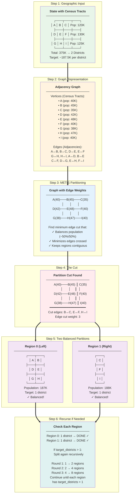

# Recursive Bisection Algorithm

This document provides a detailed explanation of the recursive bisection algorithm used for congressional redistricting.

## Core Concept

**Problem**: Partition N tracts into K districts with equal population.

**Solution**: Divide and conquer
1. Split all tracts into 2 groups (using METIS)
2. Recursively split each group until you have K districts

## Visual Walkthrough

The following diagram shows how recursive bisection works step-by-step, from geographic input through graph representation, the cut operation, and resulting partitions:



**Key Steps Explained**:
1. **Geographic Input**: Start with census tracts and their populations
2. **Graph Representation**: Convert spatial data into a graph where vertices are tracts and edges connect adjacent tracts
3. **METIS Partitioning**: Use METIS to find the optimal cut that balances population while minimizing edge cuts
4. **The Cut**: Partition the graph by removing edges (shown with ║ symbols)
5. **Balanced Partitions**: Result is two contiguous regions with nearly equal population
6. **Recurse**: If a region needs more than 1 district, split it again recursively

## Why Recursive Bisection?

**Alternative**: Direct K-way partitioning
- **Problem**: METIS struggles with large K, slow, poor balance
- **Our Solution**: Binary splits are fast and well-balanced

**Advantages**:
- Hierarchical (creates natural nested structure)
- Fast (log₂K levels of recursion)
- Good population balance at each level
- Easy to visualize (binary tree)

## Pseudocode

```python
def recursive_bisection(tracts, adjacency_graph, target_districts):
    """
    Recursively partition tracts into districts.

    Args:
        tracts: List of tract data (with population)
        adjacency_graph: NetworkX graph of tract connectivity
        target_districts: Number of districts to create

    Returns:
        assignments: dict mapping tract_idx -> district_id
    """
    if target_districts == 1:
        # Base case: assign all tracts to district 1
        return {idx: 1 for idx in range(len(tracts))}

    # Split into two groups
    split_point = target_districts // 2

    # Use METIS to partition graph into 2 balanced parts
    partition = metis_bisect(adjacency_graph, tracts_population)

    # Separate into two subgraphs
    group_0_tracts = [i for i in range(len(tracts)) if partition[i] == 0]
    group_1_tracts = [i for i in range(len(tracts)) if partition[i] == 1]

    group_0_graph = adjacency_graph.subgraph(group_0_tracts)
    group_1_graph = adjacency_graph.subgraph(group_1_tracts)

    # Recursively partition each group
    group_0_assignments = recursive_bisection(
        group_0_tracts, group_0_graph, split_point
    )

    group_1_assignments = recursive_bisection(
        group_1_tracts, group_1_graph, target_districts - split_point
    )

    # Offset group_1 district IDs
    for tract_idx, district_id in group_1_assignments.items():
        group_1_assignments[tract_idx] = district_id + split_point

    # Combine assignments
    return {**group_0_assignments, **group_1_assignments}
```

## METIS Integration

**METIS** (Multi-constraint Graph Partitioning): Fast graph partitioning library
- Input: Weighted graph + target partition sizes
- Output: Partition assignment for each node
- Objective: Minimize edge cuts (keeps geographically compact)

**Our Usage**:
```python
import pymetis

# Convert NetworkX graph to METIS format
adjacency_list = [list(adj_graph.neighbors(i)) for i in nodes]

# Partition with population weights
parts = pymetis.part_graph(
    nparts=2,                    # Binary split
    adjacency=adjacency_list,
    vweights=population_weights, # Balance population
    niter=100                    # Quality (more iterations = better)
)
```

**Why niter=100?**: Trade-off between speed and quality
- niter=10: Fast, lower quality
- niter=100: Good balance (our default)
- niter=1000: Slow, diminishing returns

## Handling Odd Numbers of Districts

**Problem**: 52 districts → 26, 26 ✓
**Problem**: 53 districts → 26, 27? or 27, 26?

**Solution**: Split as evenly as possible
```python
split_point = target_districts // 2
group_0_size = split_point
group_1_size = target_districts - split_point

# Example: 53 districts
# split_point = 53 // 2 = 26
# group_0 = 26, group_1 = 27
```

## Bisection Tree Example

**California: 52 districts**

```
                    52 districts
                   /            \
              26                 26
             /  \               /  \
           13   13            13    13
          / \   / \          / \   / \
         7  6  7  6         7  6  7  6
        ...
```

- Level 0: 1 region (all tracts)
- Level 1: 2 regions
- Level 2: 4 regions
- Level 3: 8 regions
- Level 4: 16 regions
- Level 5: 32 regions
- Level 6: 52 districts ✓

Total rounds: ⌈log₂(52)⌉ = 6 levels

## Implementation

The algorithm is implemented in `src/apportionment/partition/recursive_bisection.py`. See [ARCHITECTURE.md](ARCHITECTURE.md) for how this fits into the overall system architecture.
