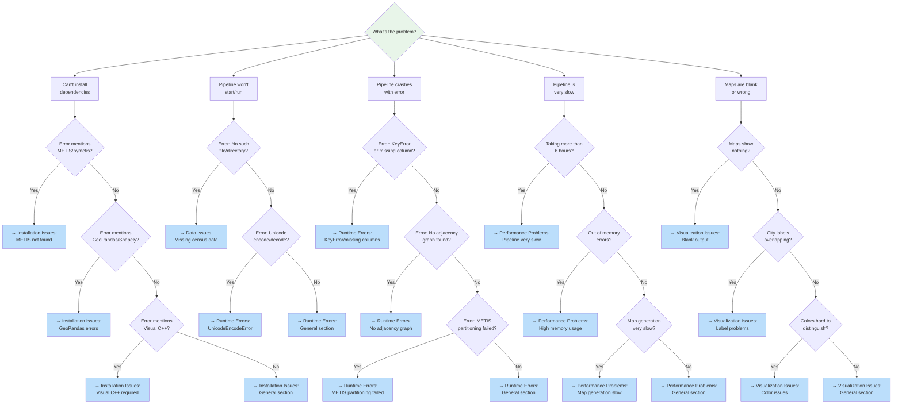

# Troubleshooting Guide

**Last Updated**: January 17, 2026

This guide covers common issues you might encounter when setting up or running the redistricting pipeline, along with step-by-step solutions.

## Table of Contents

- [Quick Diagnostic Flowchart](#quick-diagnostic-flowchart)
- [Installation Issues](#installation-issues)
- [Runtime Errors](#runtime-errors)
- [Data Issues](#data-issues)
- [Performance Problems](#performance-problems)
- [Visualization Issues](#visualization-issues)
- [Windows-Specific Issues](#windows-specific-issues)

## Quick Diagnostic Flowchart

Use this flowchart to quickly identify which section to read:



> **Tip**: View this flowchart on GitHub or in VS Code with Mermaid support for interactive navigation.

## Installation Issues

### Error: "METIS not found" or "gpmetis command not found"

**Problem**: Pipeline fails with errors about missing METIS or gpmetis command.

**Why this happens**: METIS is a graph partitioning library required for redistricting. It's not installed automatically with pip.

**Solution**:

**On Windows**:
```bash
# Option 1: Using conda (recommended)
conda install -c conda-forge metis
pip install pymetis

# Option 2: Pre-built wheels
pip install pymetis --find-links https://download.lfd.uci.edu/pythonlibs/
```

**On macOS**:
```bash
brew install metis
pip install pymetis
```

**On Linux**:
```bash
sudo apt-get install libmetis-dev  # Ubuntu/Debian
# or
sudo yum install metis-devel       # RHEL/CentOS

pip install pymetis
```

**Verify installation**:
```bash
gpmetis --help
python -c "import pymetis; print('PyMETIS installed successfully')"
```

### Error: "No module named 'geopandas'" or "No module named 'shapely'"

**Problem**: Import errors for geospatial libraries.

**Why this happens**: GeoPandas and Shapely require binary dependencies (GDAL, GEOS) that can be tricky to install.

**Solution**:

**Easiest approach (conda)**:
```bash
conda install -c conda-forge geopandas
```

**If using pip**:
```bash
# Windows: install from wheels first
pip install GDAL-3.4.3-cp310-cp310-win_amd64.whl  # adjust version
pip install geopandas

# macOS/Linux: install system dependencies
brew install gdal  # macOS
sudo apt-get install gdal-bin python3-gdal  # Ubuntu

pip install geopandas
```

**Verify installation**:
```bash
python -c "import geopandas; print('GeoPandas version:', geopandas.__version__)"
```

### Error: "Microsoft Visual C++ 14.0 or greater is required"

**Problem**: Windows installation fails with compiler errors.

**Why this happens**: Some Python packages need C++ compilation on Windows.

**Solution**:
1. Download and install **Visual Studio Build Tools**: https://visualstudio.microsoft.com/downloads/
2. Select "Desktop development with C++" workload
3. Retry pip install after installation

**Alternative**: Use pre-built wheels from https://www.lfd.uci.edu/~gohlke/pythonlibs/

## Runtime Errors

### Error: "UnicodeEncodeError: 'charmap' codec can't encode character"

**Problem**: Console output crashes on Windows with Unicode errors.

**Why this happens**: Windows Command Prompt uses CP1252 encoding which doesn't support Unicode characters like ✓, →, •.

**What to check**: Look for Unicode symbols in print statements or progress bar output.

**Solution**: The codebase should only use ASCII characters for console output.

**Code patterns**:
```python
# Bad (causes crashes on Windows)
print("✓ Complete")
print("→ Processing")
print("• Item")

# Good (ASCII only)
print("[OK] Complete")
print("-> Processing")
print("- Item")
```

**If you encounter this**: Please report it as a bug - all console output should be ASCII-safe.

### Error: "KeyError: 'GEOID'" or missing columns

**Problem**: Script crashes with missing column errors.

**Why this happens**: Census data format may have changed, or you're using incompatible data versions.

**Solution**:
1. Check your data year matches the script year:
   ```bash
   # Wrong - 2020 script with 2010 data
   python scripts/pipeline/run_state_redistricting.py --state CA --year 2020
   # But data is in data/raw/tracts_2010/
   ```

2. Re-download census data:
   ```bash
   python scripts/data/census/download_all_states_tracts.py --year 2020
   ```

3. Verify data integrity:
   ```bash
   python -c "import geopandas as gpd; df = gpd.read_file('data/raw/tracts_2020/06/06.shp'); print(df.columns)"
   # Should include: GEOID, ALAND, AWATER, geometry
   ```

### Error: "No adjacency graph found for state X"

**Problem**: Pipeline fails with missing adjacency graph.

**Why this happens**: Adjacency graphs need to be built before redistricting.

**Solution**:
```bash
# Build adjacency graph for specific state
python scripts/data/geography/build_adjacency.py --state CA --year 2020

# Or build for all states
python scripts/data/geography/build_adjacency.py --year 2020
```

**Verify**:
```bash
ls data/adjacency/2020/
# Should show: 01_adjacency.json, 06_adjacency.json, etc.
```

### Error: "METIS partitioning failed" or "Could not partition graph"

**Problem**: METIS fails to partition a region.

**Why this happens**:
- Disconnected graph (non-contiguous regions)
- Too few nodes for requested partitions
- Invalid graph structure

**Solutions**:

**Check contiguity**:
```python
import json
from pathlib import Path

# Load adjacency graph
adj_path = Path("data/adjacency/2020/06_adjacency.json")
with open(adj_path) as f:
    adj = json.load(f)

# Check for isolated nodes
isolated = [node for node, neighbors in adj.items() if len(neighbors) == 0]
print(f"Isolated nodes: {isolated}")
```

**Check partition size**:
```
# If splitting 3 tracts into 4 districts - impossible!
# Check district count is reasonable for state size
```

**Workaround**: Use `--skip-states` to exclude problematic states:
```bash
# Edit scripts/config_2020.py
STATE_DISTRICT_COUNTS = {
    # 'AK': 1,  # Comment out problematic state
    'AL': 7,
    # ...
}
```

### Error: "Population deviation too large"

**Problem**: Districts exceed ±0.5% population target.

**Why this happens**: METIS may create unbalanced partitions with small regions or disconnected graphs.

**What to check**:
```bash
# Check district populations in output
cat outputs/us_2020_v1/states/california/district_summary.csv
```

**Solutions**:
1. Increase METIS iterations:
   ```python
   # In src/apportionment/partition/metis_wrapper.py
   niter = 200  # Default is 100
   ```

2. Check for data quality issues:
   ```bash
   # Verify census tract populations are reasonable
   python -c "import geopandas as gpd; df = gpd.read_file('data/raw/tracts_2020/06/06.shp'); print(df['P0010001'].describe())"
   ```

## Data Issues

### Error: "No such file or directory: data/raw/tracts_2020/..."

**Problem**: Census data files missing.

**Why this happens**: Data needs to be downloaded separately (not in git repo due to size).

**Solution**:
```bash
# Download all states for 2020
python scripts/data/census/download_all_states_tracts.py --year 2020

# Or download single state
python scripts/data/census/download_all_states_tracts.py --year 2020 --state CA
```

**Expected structure**:
```
data/raw/tracts_2020/
  01/  # Alabama (FIPS 01)
    01.shp
    01.shx
    01.dbf
    ...
  06/  # California (FIPS 06)
    06.shp
    ...
```

### Error: "Places data not found"

**Problem**: City labeling fails with missing places data.

**Solution**:
```bash
# Download places (cities) data
python scripts/data/geography/download_places.py --year 2020
```

### Warning: "Missing city labels for district X"

**Problem**: Some districts don't have city labels in output.

**Why this happens**: Rural districts may not contain any named places, or city centroids fall outside district boundaries.

**Not an error**: This is expected for rural areas. Districts will show "No major cities" in output.

**If cities are clearly missing**:
1. Check places data downloaded:
   ```bash
   ls data/raw/places_2020/
   ```
2. Verify spatial join tolerance:
   ```python
   # In scripts/pipeline/add_cities_to_districts.py
   # Try increasing buffer distance for rural areas
   ```

## Performance Problems

### Problem: Pipeline is very slow (>6 hours for 50 states)

**Possible causes**:

**1. Not enough workers**:
```bash
# Check worker allocation
python scripts/pipeline/run_complete_redistricting.py --version v1 --workers 12
# 12 workers = 4+4+4 allocation for multi-year parallel (faster)
```

**2. Running on slow disk**:
- Use SSD instead of HDD for data directory
- Check disk space (need ~60GB free)

**3. Low memory**:
```bash
# Check memory usage
# Minimum 16GB RAM recommended for full 50-state run
# 8GB may work for single states
```

**4. Anti-virus scanning**:
- Add `data/` and `outputs/` directories to anti-virus exclusions
- Thousands of files being scanned can slow pipeline dramatically

**5. Running all stages every time**:
```bash
# Skip already-complete states (much faster)
# Don't use --reset unless you want fresh run
python scripts/pipeline/run_complete_redistricting.py --version v1
# Subsequent runs: minutes instead of hours!
```

### Problem: High memory usage / Out of memory errors

**Why this happens**: Processing large states (CA, TX, FL) with many tracts.

**Solutions**:

**1. Process states sequentially**:
```bash
# Reduce workers to limit parallel processing
python scripts/pipeline/run_complete_redistricting.py --version v1 --workers 1
```

**2. Free memory between runs**:
```python
# The pipeline should already do this, but if writing custom scripts:
import gc
gdf = None  # Release large GeoDataFrames
gc.collect()
```

**3. Process smaller states first**:
```bash
# Edit scripts/config_2020.py to process subset
STATE_DISTRICT_COUNTS = {
    'VT': 1,  # Small state
    'DE': 1,  # Small state
    # Comment out large states for testing
}
```

### Problem: Map generation is slow

**Why this happens**: High DPI settings create large images, slow rendering.

**Solution**: Use appropriate DPI for your needs:
```bash
# Fast preview (low quality)
--dpi 100

# Default (good balance)
--dpi 150

# High quality (slower)
--dpi 200

# Print quality (very slow)
--dpi 300
```

**Tip**: Use low DPI for development/testing, high DPI for final publication.

## Visualization Issues

### Problem: Maps show blank/empty output

**Possible causes**:

**1. Missing geometry data**:
```bash
# Check shapefile has geometry
python -c "import geopandas as gpd; df = gpd.read_file('data/raw/tracts_2020/06/06.shp'); print(df.geometry.isna().sum(), 'missing geometries')"
```

**2. CRS projection issues**:
```python
# Check coordinate reference system
gdf = gpd.read_file('data/raw/tracts_2020/06/06.shp')
print(gdf.crs)  # Should be EPSG:4269 or similar
```

**3. No data assigned to districts**:
```bash
# Check district assignments exist
cat outputs/us_2020_v1/states/california/district_summary.csv
# Should have rows for each district
```

### Problem: City labels overlapping or unreadable

**Why this happens**: Too many cities displayed for map size.

**Not easily configurable**: City filtering is currently based on population thresholds in code.

**Workaround**: Increase DPI to make maps larger:
```bash
--dpi 200  # More space for labels
```

### Problem: Colors difficult to distinguish

**Why this happens**: 52+ districts need many distinct colors.

**Current behavior**: Districts use ColorBrewer qualitative palettes, cycles through colors for large states.

**Tips for reading maps**:
- Use individual district maps (one district per PNG) for clarity
- Refer to district numbers in CSV outputs
- Use round-by-round maps to see progression

## Windows-Specific Issues

### Problem: "The filename, directory name, or volume label syntax is incorrect"

**Why this happens**: Windows path length limits (260 characters) or invalid characters.

**Solutions**:

**1. Shorten output paths**:
```bash
# Use shorter version names
--version v1  # Not --version detailed_experimental_run_iteration_5
```

**2. Enable long paths on Windows 10/11**:
- Run `regedit`
- Navigate to: `HKEY_LOCAL_MACHINE\SYSTEM\CurrentControlSet\Control\FileSystem`
- Set `LongPathsEnabled` to 1
- Restart

**3. Use shorter state directories**:
```bash
# Already done - we use lowercase state names
# california (not California_State_2020_Detailed)
```

### Problem: Scripts hang without output

**Why this happens**: Progress bars may not display correctly in some terminals.

**Solution**: Use Windows Terminal or Git Bash instead of Command Prompt.

**Alternative**: Check for output files being created:
```bash
# In another terminal window
ls outputs/us_2020_v1/states/
# Should see states appearing as processing continues
```

### Problem: CANCEL.bat doesn't stop pipeline

**Why this happens**: Processes may not respond to Ctrl+C immediately.

**Solution**:
```bash
# Force kill if needed
taskkill /F /IM python.exe
```

**Warning**: Force killing may leave incomplete output files. Use `--reset` on next run to clean up.

## Getting Help

If you encounter an issue not covered here:

1. **Check the logs**: Look for detailed error messages in console output
2. **Verify data**: Ensure census data and adjacency graphs are present
3. **Test with small state**: Try Vermont (1 district) or Delaware (1 district) first
4. **Check disk space**: Need ~60GB free for full 50-state run
5. **Review recent changes**: See [CHANGELOG.md](CHANGELOG.md) for known issues

**Reporting Bugs**:
When reporting issues, please include:
- Full error message and traceback
- Command you ran
- Python version: `python --version`
- Operating system and version
- Output of: `pip list | grep -E "(geopandas|shapely|pymetis)"`

**Quick Diagnostic**:
```bash
# Run diagnostic commands
python --version
python -c "import geopandas; print('GeoPandas:', geopandas.__version__)"
python -c "import pymetis; print('PyMETIS: OK')"
gpmetis --help
ls data/raw/tracts_2020/ | head -5
ls data/adjacency/2020/ | head -5
```
