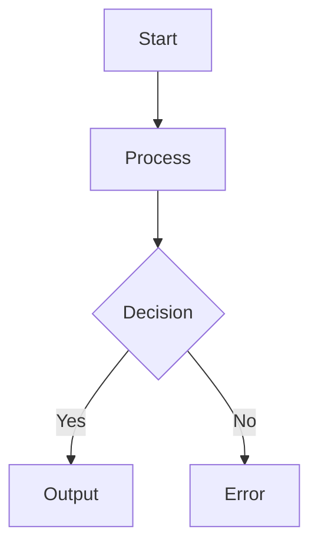

# System Architecture Diagrams

This directory contains Mermaid diagrams documenting the redistricting system architecture.

## Diagrams

### 1. System Overview (`system_overview.mmd`)
High-level component diagram showing the complete system from data sources through to final outputs.

**Shows:**
- Data sources (Census, elections, demographics)
- Processing pipeline
- Core algorithm (METIS recursive bisection)
- Analysis modules
- Visualization generation
- Output formats

### 2. Pipeline Flow (`pipeline_flow.mmd`)
Detailed workflow showing how the complete pipeline executes.

**Shows:**
- Parallel vs sequential processing modes
- Per-state processing steps
- US aggregation phase
- Political analysis phase
- Demographic analysis phase
- Compactness visualization phase

### 3. Script Dependencies (`script_dependencies.mmd`)
Tree showing script call hierarchy and dependencies.

**Shows:**
- Master orchestrator (run_complete_redistricting.py)
- Per-state processing scripts
- Analysis scripts (political, demographic, compactness)
- Library modules (src/apportionment/)
- External dependencies (METIS)

### 4. Data Flow (`data_flow.mmd`)
Shows how data transforms from raw inputs to final outputs.

**Shows:**
- Raw data formats (.shp, .txt)
- Processed data (.parquet, .pkl)
- Intermediate results (.json)
- Final outputs (.csv, .png, .html)
- Scripts that perform each transformation

### 5. Recursive Bisection Concept (`recursive_bisection_concept.mmd`)
Step-by-step explanation of how the recursive bisection algorithm works.

**Shows:**
- Geographic input (census tracts with population)
- Conversion to adjacency graph (vertices and edges)
- METIS graph partitioning with edge weights
- The minimum cut operation
- Resulting balanced partitions (before/after)
- Recursive splitting process

## Viewing Diagrams

### In GitHub
GitHub automatically renders Mermaid diagrams in markdown files. Just view the .mmd files or see them embedded in ../context/ARCHITECTURE.md.

### In VS Code
Install the "Markdown Preview Mermaid Support" extension to view diagrams in preview.

### Online
Copy the diagram code (including the \`\`\`mermaid tags) and paste into:
- [Mermaid Live Editor](https://mermaid.live/)
- [GitHub Gist](https://gist.github.com/) (supports Mermaid rendering)

### Generate PNG Images
To export diagrams as PNG for presentations:

```bash
# Install mermaid CLI
npm install -g @mermaid-js/mermaid-cli

# Generate PNG from .mmd file
mmdc -i system_overview.mmd -o system_overview.png -t default -b transparent
mmdc -i pipeline_flow.mmd -o pipeline_flow.png -t default -b transparent
mmdc -i script_dependencies.mmd -o script_dependencies.png -t default -b transparent
mmdc -i data_flow.mmd -o data_flow.png -t default -b transparent
mmdc -i recursive_bisection_concept.mmd -o recursive_bisection_concept.png -t default -b transparent
```

## Diagram Syntax

Diagrams use [Mermaid](https://mermaid.js.org/) syntax:



**Common Node Shapes:**
- `[Rectangle]` - Process or component
- `{Diamond}` - Decision point
- `((Circle))` - Start/end point
- `[[Subroutine]]` - Subprocess

**Styling:**
```mermaid
style NodeName fill:#90EE90
```

## Updating Diagrams

To modify a diagram:
1. Edit the .mmd file
2. Test rendering (GitHub, VS Code, or Mermaid Live)
3. Commit changes
4. Diagram automatically updates in GitHub/docs

## References

- [Mermaid Documentation](https://mermaid.js.org/intro/)
- [Mermaid Flowchart Syntax](https://mermaid.js.org/syntax/flowchart.html)
- [GitHub Mermaid Support](https://docs.github.com/en/get-started/writing-on-github/working-with-advanced-formatting/creating-diagrams)
