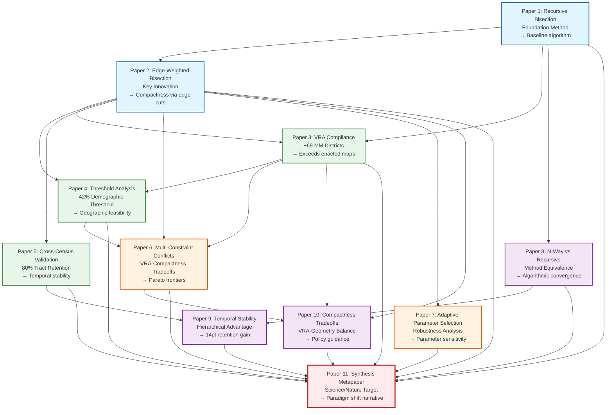

# Research Program Architecture - 10-Paper Portfolio

## Figure 1: Research Program Dependency Graph

## Paper Categories

### Foundation (Blue)
- **P1: Recursive Bisection** - Establishes baseline method
- **P2: Edge-Weighted Bisection** - Core innovation (compactness optimization)

### Empirical (Green)
- **P3: VRA Compliance** - 101% increase in MM districts
- **P4: Threshold Analysis** - 42% feasibility threshold discovery
- **P5: Cross-Census Validation** - Temporal consistency across decades

### Technical (Orange)
- **P6: Multi-Constraint Conflicts** - VRA-compactness Pareto frontiers
- **P7: Adaptive Parameter Selection** - Robustness and sensitivity analysis

### Comparison (Purple)
- **P8: N-Way vs Recursive** - Method equivalence validation
- **P9: Temporal Stability** - 14pt hierarchical advantage
- **P10: Compactness Tradeoffs** - Policy-relevant tradeoff analysis

### Synthesis (Red)
- **P11: Metapaper** - Science/Nature submission synthesizing all findings

## Key Findings by Paper

| Paper | Core Finding | Metric |
|-------|-------------|--------|
| P1 | Baseline feasibility | 435 districts, 100% contiguous |
| P2 | Compactness improvement | 56% vs unweighted baseline |
| P3 | VRA surplus | +69 MM districts (+101%) |
| P4 | Feasibility threshold | 42% demographic threshold |
| P5 | Temporal stability | 80% tract retention |
| P6 | Constraint conflicts | Pareto frontiers quantified |
| P7 | Parameter robustness | Adaptive selection validated |
| P8 | Method equivalence | N-way ≈ recursive convergence |
| P9 | Hierarchical advantage | 14pt retention over n-way |
| P10 | Policy tradeoffs | VRA-compactness guidance |
| P11 | Paradigm shift | Algorithmic objectivity at scale |

## Research Program Breadth

**Venues**: APSR (political science), KDD (algorithms), JOP (policy), PLDI (compilers), Science (interdisciplinary)
**Methods**: Graph partitioning, computational geometry, statistical analysis, legal analysis
**Contributions**: Technical (algorithms), Empirical (VRA findings), Theoretical (impossibility defense), Policy (actionable guidance)
**Scale**: 50 states × 3 census years = 1,305 districts analyzed

